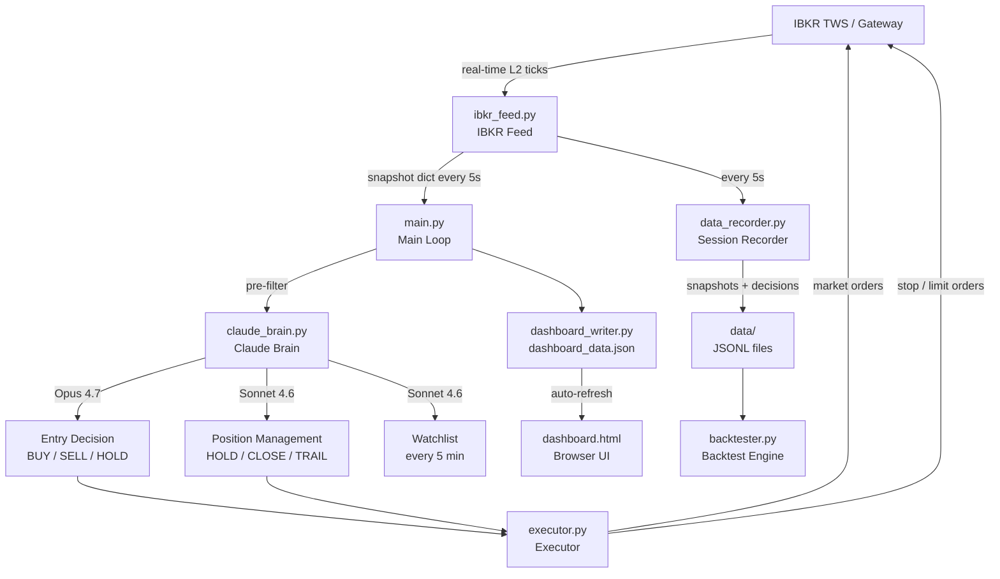
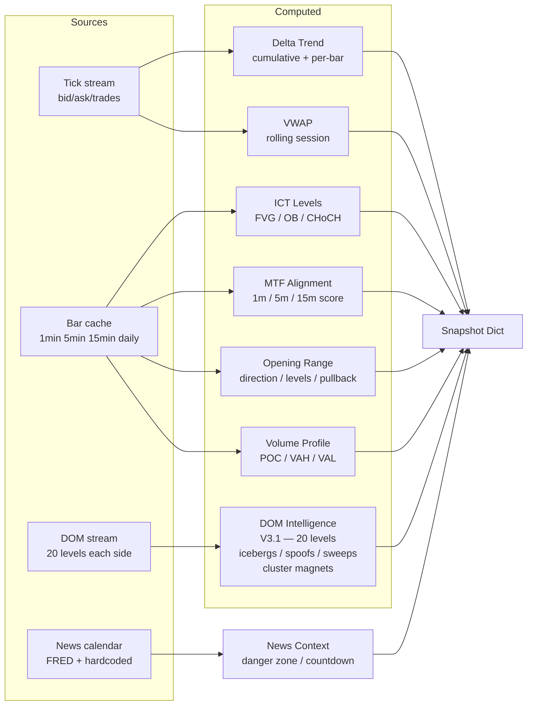
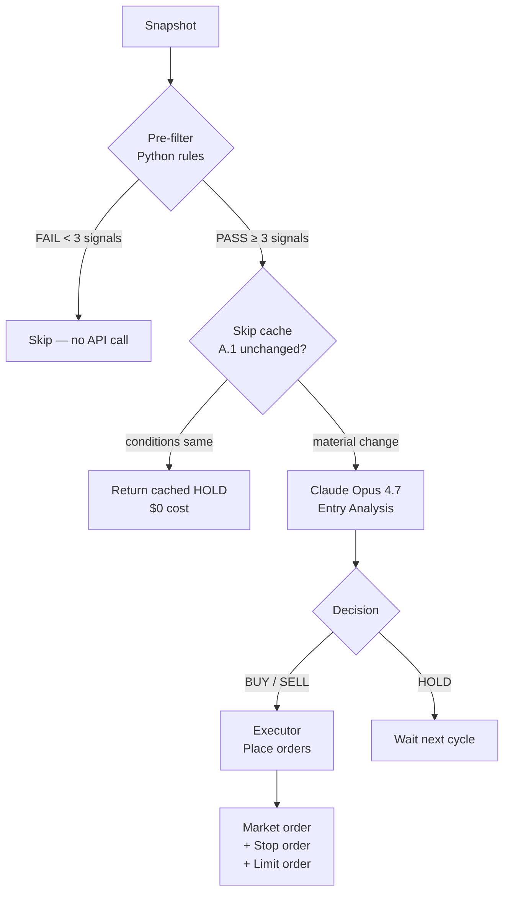
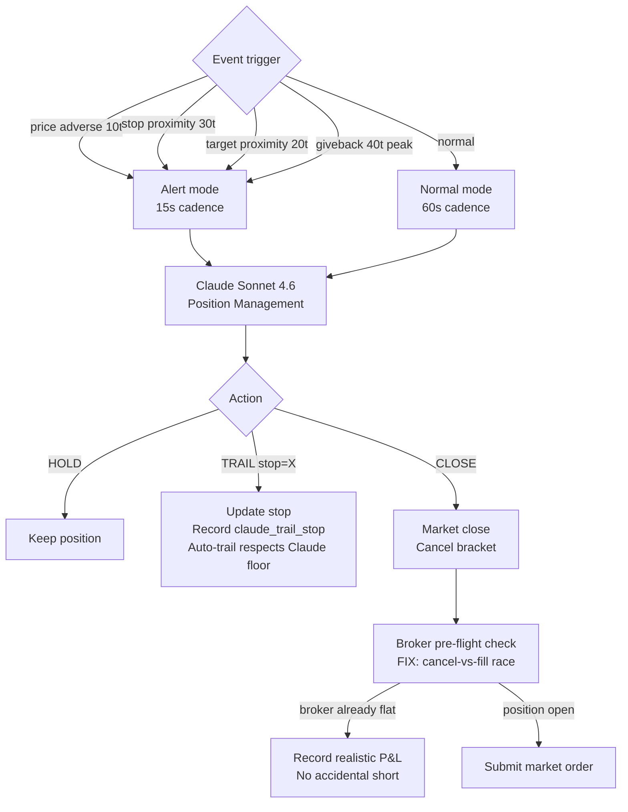
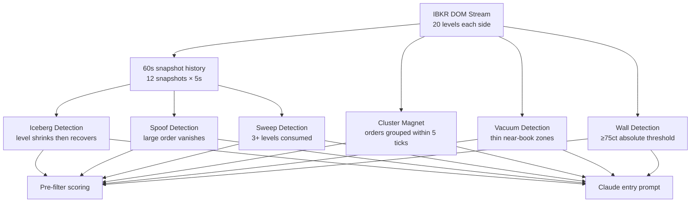
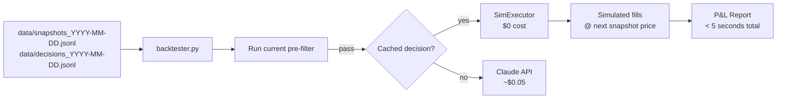
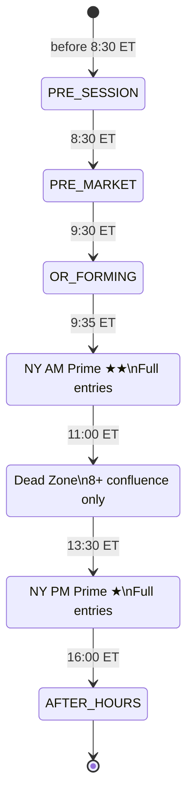

# MNQ AI Trader

An institutional-grade AI-driven futures trading bot for **MNQ (Micro E-Mini Nasdaq-100)** using **ICT (Inner Circle Trader) methodology**, **Opening Range Breakout (ORB)** strategy, and **Claude AI** for entry decisions and position management.

> **Status:** Paper trading — production-ready architecture, not yet live money.  
> **Account:** $50,000 simulated | **Max risk:** $500/day | **Max size:** 1 contract  
> **Version:** 3.1

---

## Table of Contents

1. [Architecture Overview](#architecture-overview)
2. [Data Flow](#data-flow)
3. [Strategy](#strategy)
4. [DOM — Order Book Intelligence](#dom--order-book-intelligence)
5. [AI Decision Making](#ai-decision-making)
6. [File Reference](#file-reference)
7. [Configuration](#configuration)
8. [Setup & Running](#setup--running)
9. [Dashboard](#dashboard)
10. [Backtesting](#backtesting)
11. [Risk Management](#risk-management)
12. [Session Lifecycle](#session-lifecycle)
13. [Version History](#version-history)

---

## Architecture Overview

The bot runs three concurrent loops:



### Three Loops Running Simultaneously

| Loop | Cadence | Thread | Purpose |
|---|---|---|---|
| Protection loop | 5 seconds | Background | Stop/target checks, broker reconciliation |
| Entry scan | 5 seconds | Main | Pre-filter → Claude Opus entry decisions |
| Position management | 15–60 seconds | Main (event-driven) | Claude Sonnet manages open trades |

---

## Data Flow

### Snapshot Assembly (every 5 seconds)

`ibkr_feed.py` assembles a ~50-field snapshot dict from multiple live sources:



### Entry Decision Flow



### Position Management Flow



---

## Strategy

### Opening Range Breakout (ORB) — V3.0 Bidirectional

Based on Zarattini, Barbon & Aziz (2024) — documented 1,637% return over 7 years on SPY/QQQ ORB.

**The OR is a starting bias, not a law (V3.0):**

| Time | Bias behaviour |
|---|---|
| 0–90 min after OR | OR direction = LONG_PREFERRED or SHORT_PREFERRED |
| After 90 min, structure disagrees | Bias decays to NEUTRAL automatically |
| MTF fully aligned against OR | Bias overridden to NEUTRAL immediately |
| Price 80+ pts against OR | Bias invalidated |
| NEUTRAL | Both BUY and SELL eligible based on structure |

**Three-stage ORB entry:**
1. Confirmed CLOSE outside OR range (not just a wick)
2. Price pulls back toward OR level (pullback in progress)
3. 1-min CHoCH confirms pullback complete → enter with tight stop

### ICT Methodology

| Concept | What it is | How bot uses it |
|---|---|---|
| **FVG** (Fair Value Gap) | 3-candle imbalance zone | Entry zone for pullbacks |
| **OB** (Order Block) | Last candle before impulsive move | Support/resistance anchor |
| **CHoCH** (Change of Character) | HH/HL or LH/LL break | Entry confirmation signal |
| **Liquidity pools** | Old highs/lows, equal highs | Target levels |
| **Inducement** | Retail stop-hunt before real move | Wait signal |
| **BPR** (Balanced Price Range) | Overlapping bull/bear FVGs | Chop zone — stay flat |

### Watchlist — Dual-sided Game Plan (V3.0)

Every 5 minutes, Sonnet 4.6 generates a watchlist with bias (LONG_PREFERRED / SHORT_PREFERRED / NEUTRAL / NO_TRADE), bias strength (0–100), bias invalidation flag, bull setup, bear setup, and key levels above/below.

### Pre-filter Signal Scoring (V3.1)

Pure Python — no AI. Scores bull and bear signals independently. New DOM signals added in V3.1:

**Bull signals:**

| Signal | Score |
|---|---|
| Above OR high | +2 |
| CHoCH bullish | +2 |
| Entry zone active | +2 |
| DOM ask sweep (aggressive buyers) | +2 |
| Above VWAP | +1 |
| Delta positive | +1 |
| MTF aligned / partial bull | +1 |
| DOM bid heavy / vacuum above / buy pressure >65% | +1 each |
| Iceberg bid nearby | +1 |
| Cluster magnet below (within 10pts) | +1 |
| Above VAH / above POC in VA | +1 each |

**Bear signals (symmetric)** — below OR low, CHoCH bearish, DOM bid sweep, iceberg ask, cluster magnet above, etc.

**Pass threshold:** 3+ signals on bias-preferred side, 5+ to go counter-bias.

---

## DOM — Order Book Intelligence

### V3.1 Upgrade: From 10 to 20 Levels + Advanced Detection

The DOM (Depth of Market) stream is now fully utilized. Previously only 10 of the available 20 levels were read. V3.1 uses all 20 levels on each side and adds four time-based detection algorithms using a 60-second rolling snapshot history.



### MNQ Size Thresholds

| Size | Label | Meaning |
|---|---|---|
| 1–29 ct | Normal | Retail flow |
| 30–74 ct | Significant | Active participant |
| 75–199 ct | Large / Wall | Institutional order |
| 200+ ct | Whale | Dominant position |

### Detection Algorithms

**Iceberg** — A large resting order that replenishes after being partially consumed. Detected by comparing level size across 3 consecutive snapshots: if a level ≥30ct shrinks by 40%+ then recovers to 70%+ of original size, it's an iceberg. These are the strongest real S/R levels — far more resistant than their visible size suggests because hidden quantity keeps refreshing.

**Spoof** — A large order (≥75ct) that appears then completely vanishes without price trading through it. Detected when a level present at T-2 is completely absent at T-1 and T. Spoofing is manipulation — the order was never intended to fill. Claude is told to ignore that level for directional bias.

**Sweep** — Aggressive directional activity consuming multiple levels in rapid succession. Detected when 3+ significant levels (≥30ct) on one side disappear between consecutive snapshots. An ask sweep means aggressive buyers are lifting the offer; a bid sweep means aggressive sellers are hitting the bid. Sweeps score +2 in the pre-filter (same weight as CHoCH) — they're strong conviction signals.

**Cluster Magnet** — Groups of large orders within 5 ticks (1.25 points) of each other. When the cluster total exceeds 150ct, it's flagged with a price level. Clusters are more reliable than single large orders because they represent multiple institutions at the same zone. Price tends to run to cluster magnets before reversing or continuing.

### What Claude Sees

```
DOM [████████░░] 80% buy | Bid:1,243 Ask:312 | BID_HEAVY
  Resistance wall: 29720.00
  ★ CLUSTER MAGNET ABOVE: 29725.00
  Dominant order (WHALE): 29730.00×215ct
  ⚡ VACUUM ABOVE — thin asks, price can run fast
  🧊 ICEBERG BID @ 29680.00 — replenishing support
  🔥 ASK SWEEP — aggressive buyers consuming offer side
  ASKS (20 levels):
    29700.00 ×   8
    29700.25 ×  12
    29700.50 ×   3
    ...
  BIDS (20 levels):
    29699.75 ×  85 ★LARGE
    29699.50 ×  42 ·sig
    29699.25 × 215 ★WHALE
    ...

DOM SIGNALS (structured):
  Cluster magnet above: 29725.00 | Cluster magnet below: none
  Iceberg ask: none | Iceberg bid: 29680.00
  Spoof ask: none | Spoof bid: none
  Sweep up: True | Sweep down: False
```

### Interpretation Rules Fed to Claude

- **Cluster magnet** → price tends to run to this level — use as target
- **Iceberg** → strong hidden S/R — harder to break than visible size suggests
- **Spoof** → ignore that level for bias — the order was not real
- **Sweep** → trade with the sweep direction — institutional conviction
- **Vacuum** → price moves quickly through — extend targets into vacuum zones

---

## AI Decision Making

### Model Allocation

| Decision | Model | Avg tokens | Est. cost | When |
|---|---|---|---|---|
| Watchlist | Sonnet 4.6 | ~1,700 | $0.015 | Every 5 min |
| Entry analysis | Opus 4.7 | ~5,500 | $0.05 | Pre-filter pass |
| Position management | Sonnet 4.6 | ~1,200 | $0.006 | Every 15–60s in trade |
| Pre-market brief | Opus 4.7 | ~3,000 | $0.015 | Once at 8:30 ET |

### Cost Optimizations

**A.1 — Skip-when-unchanged:** Cached HOLD returned if price moved <5pts, no new bar, watchlist fresh, <3 min elapsed. Saves ~60–70% of Opus calls.

**A.2 — Cache hygiene:** Static block (watchlist + stable session context) cached. Dynamic block (snapshot + perf context) uncached. Target: 70%+ hit rate within 5-min window.

**A.3 — Per-call cost tracking:** Every API call logs `cost=$X.XXXX session_total=$X.XX`.

### What Claude Sees (Entry Prompt Structure)

```
SYSTEM: ICT methodology, bidirectional framework, OR as starting bias,
        MTF rules, CHoCH requirements, stop/target structure, DOM rules

CACHED USER BLOCK:
  Watchlist (dual-sided: bull + bear setups, key levels)
  Stable session context (OR direction, pullback levels)

DYNAMIC (uncached):
  Performance stats | Last decision | Consecutive holds
  Snapshot: Kill Zone | AMD | HTF Bias | MTF + Score
  ICT Levels (FVGs, OBs, liquidity)
  Economic Calendar (next event countdown)
  Price | VWAP | Volume Profile
  Delta Trend (labeled: live bid/ask or approximation)
  DOM (20 levels + iceberg/spoof/sweep/cluster signals)
  Recent 1-min candles | Risk state
```

---

## File Reference

### Core Bot

| File | Size | Purpose |
|---|---|---|
| `main.py` | ~33KB | Entry point. Session state machine, run_cycle, pre-market, EOD. |
| `claude_brain.py` | ~66KB | All Claude API calls. Prompts, watchlist, entry, position management, cost tracking, skip-cache, DOM-aware pre-filter. |
| `ibkr_feed.py` | ~71KB | IBKR connection. Live ticks, bar cache, DOM stream (20 levels), snapshot assembly, ICT computation, OR tracking, DOM intelligence (V3.1). |
| `executor.py` | ~40KB | Order placement. Entry, stop, target, trail, close. Race condition fixes, R-budget, broker reconciliation. |
| `config.py` | ~7KB | All configuration. Reads `.env`, exposes typed constants. |

### Support Modules

| File | Size | Purpose |
|---|---|---|
| `dashboard_writer.py` | ~12KB | Writes `dashboard_data.json` with merge logic. |
| `memory_manager.py` | ~15KB | Session memory. Loads last 5 days, saves EOD summary. |
| `news_calendar.py` | ~27KB | Economic calendar. FRED + hardcoded. Danger zone + countdown. |
| `strategy_stats.py` | ~18KB | Per-strategy win rate / expectancy. Wilson 95% CI. |
| `data_recorder.py` | ~10KB | Records every snapshot and Claude decision to JSONL. |
| `backtester.py` | ~17KB | Replay engine. Runs current code against recorded sessions. |

### Static Files

| File | Purpose |
|---|---|
| `dashboard.html` | Browser UI. Polls JSON every 2s via JS fetch. No flicker. |
| `.env` | API keys and config. **Never commit.** |
| `.env.example` | Template — commit this instead. |

### Generated at Runtime (not committed)

| Path | What |
|---|---|
| `logs/` | Rotating log files |
| `memory/` | Session JSONL summaries + tick state |
| `data/` | Backtest recordings (snapshots + decisions JSONL) |
| `dashboard_data.json` | Live dashboard state |
| `price_data.json` | Fast ticker price cache |

---

## Configuration

### Required

```env
ANTHROPIC_API_KEY=sk-ant-...
```

### Common Settings

```env
IBKR_HOST=127.0.0.1
IBKR_PORT=7497                    # TWS paper=7497, Gateway paper=4002
IBKR_CLIENT_ID=1
CONTRACT_EXPIRY=20260618          # Update quarterly when MNQ rolls
CONTRACT_CONID=770561201
LIVE_DATA_ACTIVE=true             # Requires CME subscription
ACCOUNT_SIZE=50000
MAX_DAILY_LOSS_PCT=0.01           # 1% = $500
MAX_SESSION_R_LOSS=3.0            # Stop after 3R lost
MAX_CONTRACTS=1
CLAUDE_ENTRY_MODEL=claude-opus-4-7
CLAUDE_POSITION_MODEL=claude-sonnet-4-6
CLAUDE_USE_CACHING=true
RECORDING_ENABLED=true
```

---

## Setup & Running

### Prerequisites

```
Python 3.11
TWS or IB Gateway (paper trading enabled)
CME real-time L1+L2 subscription (or LIVE_DATA_ACTIVE=false)
Anthropic API key with Opus access
```

### Install

```bash
pip install ib_insync anthropic pandas pytz python-dotenv schedule
```

### Run

```bash
# Boot at 8:20 ET — gives 10 min before pre-market analysis
py -3.11 main.py
```

### Daily Workflow

```
8:20 ET  → py -3.11 main.py
8:30 ET  → Pre-market analysis — game plan for the day
9:30 ET  → OR forms — bias set
9:35 ET  → Active scanning begins
11:00 ET → Dead zone (8+ confluence required)
13:30 ET → NY PM prime window
15:30 ET → EOD — close positions, save memory, Ctrl+C
```

---

## Dashboard

`dashboard.html` — open in browser, no server needed.

### Layout

```
┌──────────────────────────────────────────────────────────────────┐
│ MNQ/AI │ 29680.75 │ [SCANNING] [FLAT] [NY PM KZ] [AMD] [NEWS]  │ 14:07 │
├────────┼──────────────────────────────────────┬─────────────────┤
│POSITION│ CLAUDE ANALYSIS                      │ MARKET CONTEXT  │
│FLAT    │ [HOLD] CONF:MED SCORE:5/10           │ ▲ BULLISH FIRST │
│+$0.00  │                                      │ ✓ BROKEN UP     │
│STOP  — │ Reasoning (greys if >5min stale)     │ HTF BIAS        │
│ENTRY — │ BIAS: SHORT_PREFERRED                │ ICT LEVELS      │
│TARGET— │                                      │ STRUCTURE       │
│VWAP  — │ RECENT CANDLES (1-min)               │ SESSION STATS   │
│SESS H  │ TODAY'S TRADES                       │ SESSION LEVELS  │
│CUM Δ   │                                      │                 │
│DAILY   │                                      │                 │
├────────┴──────────────────────────────────────┴─────────────────┤
│ 🟢 No major events in next hour — clean technical window        │
└──────────────────────────────────────────────────────────────────┘
```

---

## Backtesting

### How It Works



### Usage

```bash
py -3.11 backtester.py --list
py -3.11 backtester.py --date 2026-05-27
py -3.11 backtester.py --date 2026-05-27 --verbose
py -3.11 backtester.py --date 2026-05-27 --no-live-claude
```

### Version Comparison

```bash
# Baseline
py -3.11 backtester.py --date 2026-05-27
# → P&L: -$43, W:1 L:3

# Make code changes, then:
py -3.11 backtester.py --date 2026-05-27
# → P&L: +$12, W:2 L:1  ← measurable improvement
```

Full day backtest runs in **under 5 seconds**.

---

## Risk Management

### Layered Protection

```
Layer 1: Hard daily loss cap ($500 = 1% of $50K)
Layer 2: R-budget (3R per session — stops entries after 3R lost)
Layer 3: Hold-time gate (min 3 min scalp / 5 min swing before close)
Layer 4: Protection loop (5s cadence stop/target checks)
Layer 5: stop_price=0 guard (never triggers on invalid state)
Layer 6: Broker reconciliation (every 20s — catches orphan positions)
Layer 7: P&L sanity bound (rejects impossible values > $1,000/trade)
```

### Critical Race Condition Fix (V2.5)

When Claude calls CLOSE at the same moment a broker stop fires, the old code submitted a market SELL from flat — opening an accidental short. Fixed with:
1. Pre-flight broker position check before any close
2. Post-cancel recheck (stop may have filled during cancel)
3. `_infer_recent_exit_fill()` captures realistic exit from broker fills
4. Orphan check runs synchronously on main thread

### Dual-Control Trailing (V3.0)

`_claude_trail_stop` tracks Claude's explicit TRAIL decisions. Auto-trail milestones (breakeven at +50t, +25t lock at +100t, +50t lock at +150t) cannot move the stop backward past Claude's structural stop. Claude's judgment always wins.

---

## Session Lifecycle



**OR bias decay (V3.0):**
- < 90 min + thesis intact → keep bias
- MTF fully disagrees → NEUTRAL immediately
- > 90 min + price/CHoCH/MTF all against OR → NEUTRAL
- Price 80+ pts against OR → NEUTRAL

---

## Version History

| Version | Date | Key Changes |
|---|---|---|
| V1.0 | 2026-05 | Initial architecture, IBKR connection, basic ORB |
| V2.0 | 2026-05 | Prompt caching, session memory, ICT levels, dashboard |
| V2.5 | 2026-05-22 | **P0 race condition fix** — cancel-vs-fill race causing accidental shorts and phantom P&L |
| V3.0 | 2026-05-22 | Bidirectional bias (LONG_PREFERRED not LONG_ONLY), dual-sided watchlist, bias decay, backtest recording system, R-budget, dual-control trailing, MTF score, delta labeling |
| V3.1 | 2026-05-22 | **DOM upgrade** — full 20 levels, iceberg detection, spoof detection, sweep detection, cluster magnet detection, MNQ absolute thresholds |

---

## Disclaimer

For **educational and research purposes only**. Trading futures involves substantial risk of loss. Past performance does not guarantee future results. Not financial advice. Use at your own risk.
