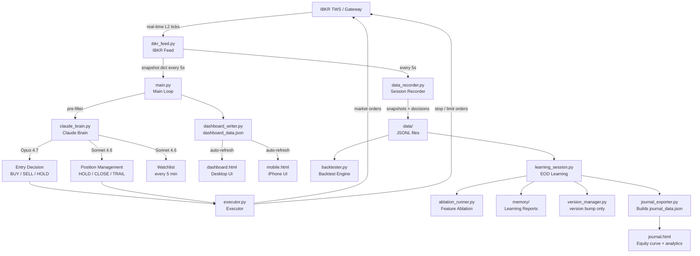
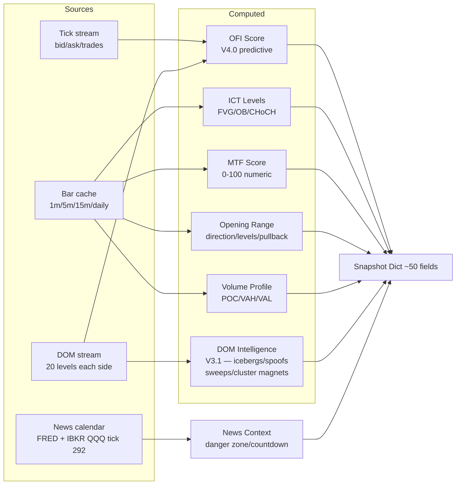
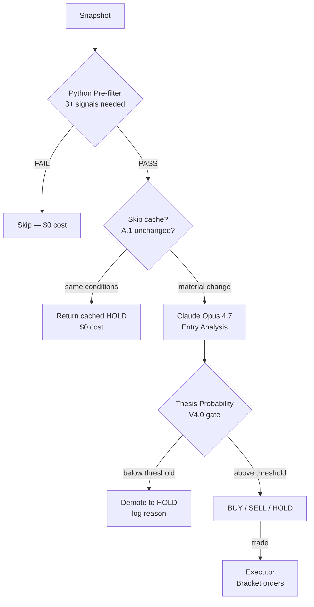
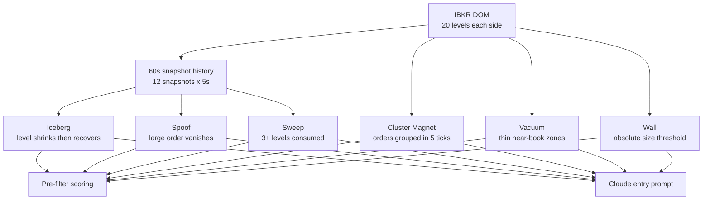
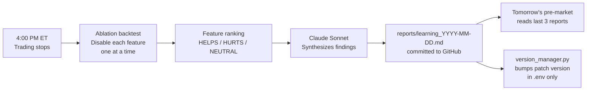
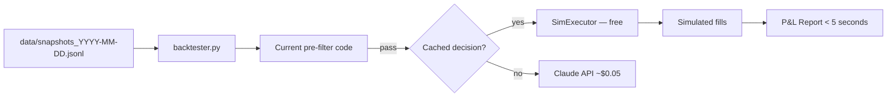
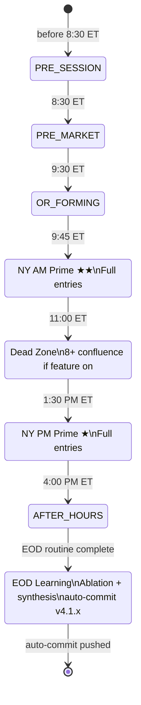

# MNQ AI Trader

An institutional-grade AI-driven futures trading bot for **MNQ (Micro E-Mini Nasdaq-100)** using **ICT (Inner Circle Trader) methodology**, **Opening Range Breakout (ORB)** strategy, and **Claude AI** for entry decisions and position management.

> **Status:** Paper trading — production-ready architecture, not yet live money.
> **Account:** $50,000 simulated | **Max risk:** $500/day | **Max size:** 1 contract
> **Version:** 4.3.x (auto-managed)

**Deeper docs:**
- `CLAUDE.md` — AI-assistant guidance, architecture truth, audit-tag reference
- `PROJECT_SUMMARY.md` — dense technical map (modules, snapshot schema, JSON schemas, invariants)
- `KNOWLEDGE_BASE.md` — academic research on strategy win rates and probability calibration
- `BOT_EVALUATION.md` — performance evaluation framework and rolling stats
- `ROADMAP.md` — completed work and what's next (V4.4 session replay, session-type classifier, etc.)

---

## Table of Contents

1. [Architecture Overview](#architecture-overview)
2. [Data Flow](#data-flow)
3. [Strategy](#strategy)
4. [DOM — Order Book Intelligence](#dom--order-book-intelligence)
5. [AI Decision Making](#ai-decision-making)
6. [Predictive Features — V4.0](#predictive-features--v40)
7. [Feature Flags — V4.1](#feature-flags--v41)
8. [EOD Learning System — V4.1](#eod-learning-system--v41)
9. [File Reference](#file-reference)
10. [Configuration](#configuration)
11. [Setup & Running](#setup--running)
12. [Dashboard](#dashboard)
13. [Mobile Dashboard](#mobile-dashboard)
14. [Backtesting](#backtesting)
15. [Risk Management](#risk-management)
16. [Session Lifecycle](#session-lifecycle)
17. [Version History](#version-history)

---

## Architecture Overview

Three concurrent loops running simultaneously:



### Three Loops

| Loop | Cadence | Purpose |
|---|---|---|
| Protection loop | 5 seconds | Stop/target checks, broker reconciliation |
| Entry scan | 5 seconds | Python pre-filter → Claude Opus entry decisions |
| Position management | 15–60 seconds | Claude Sonnet manages open trades |
| Pre-market sleep | 30 minutes | Process stays alive nights/weekends; blocks weekends, CME holidays, early closes; dashboard shows `botSleeping=true` during sleep |

---

## Data Flow

### Snapshot Assembly (every 5 seconds)



### Entry Decision Flow



---

## Strategy

### Opening Range Breakout (ORB) — V3.0 Bidirectional

Based on Zarattini, Barbon & Aziz (2024).

**OR as starting bias, not a law:**

| Condition | Bias |
|---|---|
| 0–90 min, thesis intact | LONG_PREFERRED or SHORT_PREFERRED |
| MTF fully disagrees | → NEUTRAL immediately |
| > 90 min + price/CHoCH/MTF all against OR | → NEUTRAL |
| Price 80+ pts against OR | → NEUTRAL |
| NEUTRAL | Both BUY and SELL eligible |

**Three-stage ORB entry:**
1. Confirmed CLOSE outside OR (not a wick)
2. Price pulls back toward OR level
3. 1-min CHoCH confirms pullback complete → enter

### ICT Concepts

| Concept | What it is | How bot uses it |
|---|---|---|
| **FVG** | 3-candle imbalance zone | Entry zone for pullbacks |
| **OB** | Last candle before impulsive move | Support/resistance anchor |
| **CHoCH** | HH/HL or LH/LL structural break | Entry confirmation |
| **Liquidity pools** | Old highs/lows, equal highs | Price targets |
| **Inducement** | Retail stop-hunt before real move | Wait signal |

### Session Levels

Computed in `_update_session_levels()` in `ibkr_feed.py` and injected into the snapshot each cycle:

| Level | Source |
|---|---|
| Session high / low | Rolling intraday extremes |
| OR high / low | First 15 minutes of RTH (9:30–9:45 ET) — three 5-min bars |
| VWAP | Volume-weighted average price |
| Previous week high / low | `prev_week_high` / `prev_week_low` — calculated from the daily bar cache and included in Claude's snapshot as reference levels for weekly liquidity |
| Premarket high / low (V4.2) | `premarket_high` / `premarket_low` — 4am–9am ET globex extremes, computed in `_update_session_levels()`. Pre-filter adds 4 signals (above/below/testing each level). |
| Daily demand/supply zones (V4.2) | `daily_zones` — `{demand_zones, supply_zones, near_demand, near_supply, zones_text}` built from daily-bar reversals via `_find_daily_zones()`. Pre-filter adds +1 bull near demand, +1 bear near supply. |
| Candle patterns (V4.2) | `candle_patterns` — string describing detected patterns on 1m/5m bars (engulfing, hammer, shooting star, morning/evening star, inside-bar breakout). Source: `_detect_candle_patterns()`. |
| Tape bias (V4.2) | `tape_bias` — `AGGRESSIVE_BUYING` / `AGGRESSIVE_SELLING` / `NEUTRAL` from large-print rolling counts. Pre-filter adds ±2 signals. Full `tape_analysis` dict also injected. |

### Pre-filter Signal Scoring

Pure Python — no AI cost. Scores bull and bear independently.

**Top signals by weight:**

| Signal | Bull | Bear | Score |
|---|---|---|---|
| DOM sweep (aggressive buyers/sellers) | ✓ | ✓ | +2 |
| CHoCH confirmation | ✓ | ✓ | +2 |
| Above/below OR level | ✓ | ✓ | +2 |
| OFI STRONG signal | ✓ | ✓ | +2 |
| Entry zone active | ✓ | ✓ | +2 |
| OFI BUY/SELL signal | ✓ | ✓ | +1 |
| OFI accelerating | ✓ | ✓ | +1 |
| Above/below VWAP | ✓ | ✓ | +1 |
| Delta trend aligned | ✓ | ✓ | +1 |
| MTF aligned/partial | ✓ | ✓ | +1 |
| DOM imbalance | ✓ | ✓ | +1 |
| Iceberg bid/ask nearby | ✓ | ✓ | +1 |
| Cluster magnet nearby | ✓ | ✓ | +1 |
| Volume profile breakout | ✓ | ✓ | +1 |

**Pass threshold:** 3+ signals on bias-preferred side, 5+ to go counter-bias.

---

## DOM — Order Book Intelligence

### V3.1 — Full 20 Levels + Advanced Detection



### MNQ Size Thresholds

| Size | Label | Meaning |
|---|---|---|
| 1–29 ct | Normal | Retail flow |
| 30–74 ct | Significant | Active participant |
| 75–199 ct | Large / Wall | Institutional |
| 200+ ct | Whale | Dominant order |

### Detection Algorithms

**Iceberg** — Level shrinks then recovers to 70%+ of original. Hidden quantity keeps refreshing. Treat as stronger S/R than visible size suggests.

**Spoof** — Large order (≥75ct) appears then vanishes without trading. Detected across 3 snapshots. Claude told to ignore this level for bias.

**Sweep** — 3+ significant levels consumed between snapshots. Ask sweep = aggressive buyers. Scores +2 in pre-filter (same as CHoCH).

**Cluster Magnet** — Groups of large orders within 5 ticks (1.25 pts). When cluster total ≥150ct, flagged as price target. More reliable than single large orders.

---

## AI Decision Making

### Model Allocation

| Decision | Model | Est. cost | When |
|---|---|---|---|
| Watchlist | Sonnet 4.6 | ~$0.011 | Every 5 min |
| Entry analysis | Opus 4.7 | ~$0.05 | Pre-filter pass |
| Position management | Sonnet 4.6 | ~$0.006 | Every 15–60s in trade |
| Pre-market brief | Opus 4.7 | ~$0.015 | Once at 8:30 ET |
| EOD learning | Sonnet 4.6 | ~$0.02 | Once at EOD |

### Cost Optimizations

**A.1 Skip-when-unchanged:** If Opus returned HOLD and price <5pts move, no new bar, watchlist fresh, <3 min elapsed → return cached decision. Saves ~60–70% of Opus calls.

**A.2 Cache hygiene:** Static block (watchlist + stable session context) carries Anthropic cache marker. Dynamic block (snapshot, perf context) never cached. Target: 60–70% cache hit rate within 5-min window.

**A.3 Per-call cost tracking:** Every call logs `cost=$X.XXXX session_total=$X.XX`.

### What Claude Sees (Entry Prompt)

```
SYSTEM: ICT methodology, bidirectional framework, thesis probability
        calibration guide, DOM interpretation rules

CACHED:
  Active watchlist (dual-sided: bull + bear setups, key levels)
  Stable session context (OR direction, pullback levels)

DYNAMIC:
  Performance stats | Last N days learning findings (V4.1)
  MNQ MARKET SNAPSHOT — HH:MM ET
    Kill Zone | AMD | HTF Bias
    MTF Alignment + Score (0-100)
    ICT Levels (FVGs, OBs, liquidity)
    Economic Calendar + IBKR live headlines (QQQ tick 292)
    Price | VWAP | Volume Profile
    OFI Score (-100 to +100) + signal + acceleration + divergence
    Delta Trend (labeled: live bid/ask or approximation)
    DOM (20 levels + iceberg/spoof/sweep/cluster signals)
    Recent 1-min candles | Risk state
```

---

## Predictive Features — V4.0

### Thesis Probability Gate

Claude outputs `THESIS_PROBABILITY: 0-100` on every entry decision.

**Calibration:**
- 90–100: Everything aligned — rare, highest conviction
- 75–89: Strong setup — normal entry range
- 60–74: Marginal — only in prime kill zones
- 0–59: No trade — demoted to HOLD automatically

The bot gates entries: if probability > 0 and < `MIN_THESIS_PROBABILITY` (default 70), BUY/SELL is demoted to HOLD before reaching the executor. Logged as:

```
Thesis probability 58% below threshold 70% — demoting SELL to HOLD
Claude: BUY | Prob: 82% | Conf: HIGH | Mode: SCALP
```

### Order Flow Imbalance (OFI)

Computed from the 60-second DOM history buffer using Cont, Kukanov & Stoikov (2014) methodology:

```
OFI = Σ (ΔBid - ΔAsk) over last 12 snapshots
```

Positive OFI = net buying pressure. Negative = net selling.

**Output fields:**
- `score`: -100 to +100 normalized
- `signal`: STRONG_BUY / BUY / NEUTRAL / SELL / STRONG_SELL
- `acceleration`: ACCELERATING / DECELERATING / STABLE
- `divergence`: True if OFI disagrees with price direction

**Pre-filter scoring:** STRONG_BUY/SELL = +2, BUY/SELL = +1, ACCELERATING = +1.

**Claude prompt rules:** STRONG_BUY + ACCELERATING → +10 to thesis probability for longs. Divergence → -10.

### IBKR Live News (tick 292)

Subscribed via QQQ ETF (futures don't support news ticks). When IBKR delivers a Nasdaq-relevant headline, it fires `_on_tick_news`, stores the last 10 headlines, logs them, and injects the latest 3 into Claude's entry prompt.

Requires an IBKR news subscription (e.g. Briefing.com). Silently does nothing without one.

---

## Feature Flags — V4.1

Every major feature can be toggled in `.env` for live trading and ablation testing. Safety features (stops, race condition fixes, position limits) are hardcoded and never flagged.

```env
# Strategy / Bias
FEATURE_ORB_BIAS=true        # OR direction as starting bias
FEATURE_BIDIRECTIONAL=true   # Allow shorts on bull days
FEATURE_BIAS_DECAY=true      # Bias decays to NEUTRAL after 90min
FEATURE_DOJI_MTF_OVERRIDE=true # On DOJI OR days, allow trades when MTF is BULLISH_ALIGNED or BEARISH_ALIGNED (5+ signals required)

# Predictive Signals
FEATURE_OFI=true             # Order Flow Imbalance score
FEATURE_DOM_ADVANCED=true    # Iceberg/spoof/sweep/cluster detection
FEATURE_MTF_SCORE=true       # Numeric MTF alignment score
FEATURE_DELTA_LIVE=true      # True bid/ask delta classification

# Entry Gates
FEATURE_THESIS_GATE=true     # Thesis probability threshold gate
FEATURE_R_BUDGET=true        # Session R-loss cap
FEATURE_NEWS_GATE=true       # Block entries near high-impact news
FEATURE_DEAD_ZONE=true       # Reduce entries 11am-1:30pm ET

# Position Management
FEATURE_DUAL_TRAIL=true      # Claude trail anchors auto-trail
FEATURE_EARLY_EXIT=true      # Allow Claude to close before stop

# Learning
FEATURE_LEARNING_EOD=true    # Run ablation + learning at EOD
FEATURE_LEARNING_INJECT=true # Inject learnings into pre-market
```

---

## EOD Learning System — V4.1

At 4:00 PM ET after trading stops, the system automatically:



### Ablation Testing

Runs the backtest with each feature disabled one at a time to measure isolated contribution:

```
Baseline (all ON):  4T  75%WR  +$42.00

Removing each feature:
  OFI Score         3T  67%WR  +$28.00  → Feature contribution: +$14.00  HELPS
  DOM Advanced      4T  75%WR  +$35.00  → Feature contribution: +$7.00   HELPS
  Dead Zone         5T  60%WR  +$48.00  → Feature contribution: -$6.00   HURTS
  Thesis Gate       6T  50%WR  +$12.00  → Feature contribution: +$30.00  HELPS
  ...
```

Reports saved to `reports/` (committed to git) and `memory/` (for pre-market injection).

### Soft Learning

Claude's findings are injected into the next day's pre-market prompt:

```
LEARNING FROM RECENT SESSIONS
2026-05-27:
  OFI was strongly predictive on trend days but noisy during chop.
  DOM sweeps preceded all 3 winning trades. Dead zone entries
  underperformed — consider raising threshold to 8+ signals.
  Confidence: Medium (4 trades, limited sample)
```

Learning is **soft** — Claude reads findings and adjusts reasoning. No automatic `.env` changes.

### Auto-versioning

Every EOD auto-commit bumps the patch version:

```
4.1.0  → initial release
4.1.1  → config audit — magic numbers → named constants
4.1.2  → first EOD learning session
...
4.2.0  → new feature shipped (minor bump)
5.0.0  → architectural change (major bump)
```

---

## File Reference

### Core Bot

| File | Size | Purpose |
|---|---|---|
| `main.py` | ~34KB | Entry point. Session state machine, run_cycle, pre-market, EOD learning trigger. |
| `claude_brain.py` | ~72KB | All Claude API calls. Prompts, watchlist, entry analysis, position management, cost tracking, skip-cache, feature-flagged pre-filter, learning injection. |
| `ibkr_feed.py` | ~83KB | IBKR connection. Live ticks, bar cache, DOM stream (20 levels), snapshot assembly, ICT computation, OFI engine, OR tracking, IBKR news (QQQ tick 292). |
| `executor.py` | ~40KB | Order placement. Entry, stop, target, trail, close. Race condition fixes, R-budget, broker reconciliation, dual-control trailing. |
| `config.py` | ~18KB | All configuration. Reads `.env`, exposes ~120 typed constants across 20 sections, 15 feature flags, `get_active_features()`, `features_summary()`. |

### Support Modules

| File | Size | Purpose |
|---|---|---|
| `dashboard_writer.py` | ~12KB | Writes `dashboard_data.json` with merge logic. Includes version, thesis probability, IBKR headlines. `bot_sleeping`/`wake_time` fields drive dashboard sleeping state. |
| `memory_manager.py` | ~15KB | Session memory. Loads last 5 days, saves EOD summary. |
| `news_calendar.py` | ~27KB | Economic calendar. FRED + hardcoded recurring. Danger zone gating, countdown to next event. |
| `strategy_stats.py` | ~18KB | Per-strategy win rate / expectancy. Wilson 95% CI. |
| `data_recorder.py` | ~10KB | Records every snapshot and Claude decision to JSONL. |
| `backtester.py` | ~17KB | Replay engine. Runs current code against recorded sessions. |

### V4.1 New Modules

| File | Size | Purpose |
|---|---|---|
| `version_manager.py` | ~7KB | Auto-versioning. Reads/writes BOT_VERSION in .env. Git add/commit/push/tag at EOD. |
| `ablation_runner.py` | ~10KB | Ablation test engine. Disables each feature flag one at a time, runs backtest, returns HELPS/HURTS/NEUTRAL ranking. |
| `learning_session.py` | ~11KB | EOD orchestrator. Runs ablation → Claude synthesis → save reports → auto-commit → journal export. |
| `journal_exporter.py` | ~8KB | Rebuilds `journal_data.json` from all `decisions_*.jsonl` JSONL files at EOD. Schema: equity curve, per-strategy stats, by-hour breakdown, OFI performance, thesis probability buckets. |

### Static Files

| File | Purpose |
|---|---|
| `dashboard.html` | Desktop browser UI. Three-column layout, polls JSON every 2s. |
| `mobile.html` | iPhone-optimized UI. Single column, big text, polls every 5s. Add to home screen. Shows yellow `BOT SLEEPING` with wake time when bot is dormant. |
| `journal.html` | EOD analytics UI. Equity curve, full trade log, per-strategy/hour/OFI/thesis breakdowns. Reads `journal_data.json`. |
| `.env` | API keys and config. **Never commit.** |
| `.env.example` | Template — commit this. |

### Generated at Runtime (not committed)

| Path | What |
|---|---|
| `logs/` | Rotating log files |
| `memory/` | Session JSONL summaries + tick state + learning reports (local injection) |
| `data/` | Backtest recordings (snapshots + decisions JSONL) |
| `reports/` | Learning + ablation reports — **committed to git** |
| `dashboard_data.json` | Live dashboard state |
| `price_data.json` | Fast ticker price cache |

---

## Configuration

### Required

```env
ANTHROPIC_API_KEY=sk-ant-...
```

### Common Settings

```env
# IBKR
IBKR_HOST=127.0.0.1
IBKR_PORT=7497                    # TWS paper=7497, Gateway paper=4002
IBKR_CLIENT_ID=1

# Contract — update quarterly when MNQ rolls
CONTRACT_EXPIRY=20260618
CONTRACT_CONID=770561201

# Data
LIVE_DATA_ACTIVE=true             # Requires CME L1+L2 subscription

# Risk
ACCOUNT_SIZE=50000
MAX_DAILY_LOSS_PCT=0.01           # 1% = $500
MAX_SESSION_R_LOSS=3.0            # Stop after 3R lost in session
MAX_CONTRACTS=1

# AI Models
CLAUDE_ENTRY_MODEL=claude-opus-4-7
CLAUDE_POSITION_MODEL=claude-sonnet-4-6
CLAUDE_USE_CACHING=true

# V4.0
MIN_THESIS_PROBABILITY=70         # Block entries below this confidence

# V4.1
BOT_VERSION=4.1.0                 # Auto-managed by version_manager.py
RECORDING_ENABLED=true
```

### Advanced Tuning (V4.1.1)

All constants below are in `config.py` and overridable via `.env`. Defaults are production-tested — only adjust if ablation data or live session logs suggest a specific change.

**Session Times (HHMM integers)**

```env
SESSION_PRE_MARKET_TIME=830       # Pre-market analysis window start
SESSION_MARKET_OPEN_TIME=930      # RTH open, OR begins forming
SESSION_OR_FORMING_END=945        # OR established after this (end of 15-min window)
SESSION_PRIME_WINDOW_END=1100     # NY AM prime window ends
SESSION_DEAD_ZONE_END=1330        # Dead zone ends, PM prime begins
SESSION_CLOSING_END=1600          # RTH close
EOD_SCHEDULE_TIME=15:30           # Positions closed, EOD routine fires
MAIN_LOOP_SLEEP_SECS=0.5          # Main cycle sleep between ticks
```

**Entry Gates**

```env
DEAD_ZONE_CONFLUENCE_THRESHOLD=8  # Signals required during dead zone
POS_STRUCTURE_MIN_PROFIT_TICKS=20 # Min profit before structure CLOSE eligible
POS_STRUCTURE_PULLBACK_TICKS=5    # Pullback that re-arms structure check
ENTRY_MODE=LIMIT                  # "LIMIT" tries a limit order first; "MARKET" always uses MKT
LIMIT_ORDER_MAX_SLIPPAGE=4        # Ticks — if price moves this far from entry_price, skip limit and go MKT immediately
LIMIT_ORDER_TIMEOUT_SECS=5        # Seconds to wait for limit fill before cancelling and falling back to MKT
```

**Pre-filter Signal Scoring**

```env
PRE_FILTER_SIGNAL_THRESHOLD=3     # Signals needed with bias
COUNTER_TREND_SIGNAL_THRESHOLD=5  # Signals needed counter-trend
```

**Skip-Cache Tuning (A.1)**

```env
SKIP_CACHE_PRICE_DELTA=5.0        # Price move that invalidates cache (pts)
SKIP_CACHE_MAX_AGE_SECS=180       # Max cache age before forced refresh (3 min)
SKIP_CACHE_WATCHLIST_AGE_SECS=60  # Watchlist age that invalidates cache
SKIP_LOG_EVERY_N=5                # Log every Nth cache hit (reduces noise)
```

**OR Thesis**

```env
OR_THESIS_INVALIDATION_POINTS=80  # Price distance that flips bias to NEUTRAL
OR_PULLBACK_THRESHOLD_PCT=0.3     # Pullback % of OR range to arm entry
```

**DOM Signal Thresholds**

```env
DOM_HISTORY_MAX_SNAPSHOTS=12      # Rolling DOM history (12 x 5s = 60s)
DOM_SIGNIFICANT_SIZE=30           # Min size to flag as significant
DOM_LARGE_SIZE=75                 # Institutional / wall threshold
DOM_WHALE_SIZE=200                # Dominant order threshold
DOM_BUY_PRESSURE_BULL_THRESHOLD=0.65   # DOM buy ratio for bull signal
DOM_SELL_PRESSURE_BEAR_THRESHOLD=0.35  # DOM buy ratio for bear signal
DOM_CLUSTER_TOLERANCE_POINTS=1.25      # Grouping tolerance for cluster magnet
DOM_VACUUM_THRESHOLD_SIZE=5            # Size below which a level is "vacuum"
DOM_ICEBERG_SHRINK_PCT=0.6             # Size shrink % to flag iceberg
DOM_ICEBERG_RECOVERY_PCT=0.7           # Recovery % to confirm iceberg
DOM_SWEEP_LEVEL_THRESHOLD=3            # Levels consumed to call a sweep
```

**OFI Thresholds**

```env
OFI_STRONG_THRESHOLD_CONTRACTS=500    # Raw OFI magnitude for STRONG signal
OFI_ACCELERATION_THRESHOLD=1.3        # OFI ratio to call ACCELERATING
OFI_DECELERATION_THRESHOLD=0.7        # OFI ratio to call DECELERATING
OFI_STRONG_BUY_THRESHOLD=60           # Normalized score for STRONG_BUY
OFI_BUY_THRESHOLD=25                  # Normalized score for BUY
OFI_STRONG_SELL_THRESHOLD=-60         # Normalized score for STRONG_SELL
OFI_SELL_THRESHOLD=-25                # Normalized score for SELL
DELTA_DIVERGENCE_THRESHOLD=500        # Raw delta to flag direction divergence
```

**Volume Profile**

```env
VOLUME_PROFILE_TARGET_PCT=0.70    # Value area target (70% of session volume)
POC_PROXIMITY_POINTS=5.0          # Distance to POC that triggers signal
```

**ICT Level Proximity**

```env
FVG_PROXIMITY_POINTS=100.0        # Distance to FVG that activates entry zone
OB_PROXIMITY_POINTS=150.0         # Distance to OB that activates entry zone
LIQUIDITY_POOL_TOLERANCE=2.0      # Cluster tolerance for liquidity pool detection
```

**Bar Cache & Streams**

```env
TICK_STATE_PERSIST_INTERVAL_SECS=30    # How often tick state writes to disk
INIT_BARS_1MIN_DURATION=7200 S         # Historical 1-min bar request window
INIT_BARS_5MIN_DURATION=86400 S        # Historical 5-min bar request window
INIT_BARS_15MIN_DURATION=2 D           # Historical 15-min bar request window
INIT_BARS_DAILY_DURATION=30 D          # Historical daily bar request window
REALTIME_BARS_PER_MINUTE=12            # 5-sec bars accumulated per 1-min bar
BARS_1MIN_CACHE_SIZE=120               # Max 1-min bars kept in memory
SNAPSHOT_ASSEMBLY_SLEEP_SECS=0.3       # Pause after DOM request in snapshot
NEWS_CACHE_TTL_SECS=600                # News freshness window (10 min)
```

**Executor Safety**

```env
PROTECTION_RECONCILE_EVERY_N_LOOPS=4      # Broker reconcile every N protection loops
DELAYED_DATA_STALENESS_THRESHOLD_POINTS=20 # Price staleness alert threshold
MAX_REASONABLE_PNL_PER_CONTRACT=1000.0    # P&L sanity bound — rejects above this
RBUST_MAX_R_PER_TRADE=1.5                 # Max R gain per trade (R-budget cap)
TRAIL_PROFIT_1_TICKS=120                  # Ticks profit to trigger milestone-1 trail
TRAIL_PROFIT_1_LOCK=30                    # Ticks above entry to lock stop at milestone 1
TRAIL_PROFIT_2_TICKS=180                  # Ticks profit to trigger milestone-2 trail
TRAIL_PROFIT_2_LOCK=60                    # Ticks above entry to lock stop at milestone 2
```

---

## Setup & Running

### Prerequisites

```
Python 3.11
TWS or IB Gateway (paper trading enabled, API connections on)
CME real-time L1+L2 subscription (or LIVE_DATA_ACTIVE=false)
Anthropic API key with Opus access
```

### Install

```bash
pip install ib_insync anthropic pandas pytz python-dotenv schedule exchange-calendars
```

`exchange-calendars` (XNYS) enables CME holiday and early-close detection. Without it the bot falls back to weekend-only gating and logs a warning.

### Push Notifications (optional, V4.3)

`notifier.py` sends iPhone push alerts via Pushover for key bot events (pre-market ready, OR established, trade entered/exited, stop→BE, EOD summary, IBKR connection events, loss warnings, errors, bot sleeping/awake).

```env
PUSHOVER_USER_KEY=u-your-user-key
PUSHOVER_API_TOKEN=a-your-app-token
NOTIFY_ENABLED=true
```

Get keys from `pushover.net` (one-time $5 per platform). Without keys, notifications are silently disabled — bot runs normally.

### Run

```bash
# Terminal 1 — the bot (boot at 8:20 ET)
py -3.11 main.py

# Terminal 2 — dashboard server
py -3.11 -m http.server 8080
```

Or use `start_trading.bat` to launch both with one double-click.

### Daily Workflow

```
8:20 ET  → py -3.11 main.py
8:30 ET  → Pre-market analysis (Opus) — injects last 3 learning reports
9:30 ET  → OR forms, bias sets
9:45 ET  → OR complete, active scanning begins
11:00 ET → Dead zone (8+ confluence required if FEATURE_DEAD_ZONE=true)
13:30 ET → NY PM prime window
15:30 ET → EOD: close positions, save memory
16:00 ET → Learning session: ablation + Claude synthesis + auto-commit
```

---

## Dashboard

### Desktop — `dashboard.html`

Open `http://localhost:8080/dashboard.html`. Three-column layout:

```
┌─────────────────────────────────────────────────────────┐
│ MNQ/AI v4.1  29,680.75  [SCANNING][FLAT][AM PRIME][...] │ 09:47:22 │
├─────────────────────────────────────────────────────────┤
│[MARKET STATUS] NY AM PRIME ★★  Dead zone in 13m         │
├──────────┬──────────────────────────────┬───────────────┤
│POSITION  │ CLAUDE ANALYSIS              │ MARKET CONTEXT│
│FLAT      │ [HOLD] PROB 82% SCORE 6/10  │ ▲ BULLISH     │
│+$0.00    │                              │ HTF BIAS      │
│STOP  —   │ Reasoning text...            │ ICT LEVELS    │
│ENTRY —   │ BIAS: SHORT_PREFERRED        │ STRUCTURE     │
│TARGET —  │ RECENT CANDLES               │ SESSION STATS │
│RISK      │ TODAY'S TRADES               │ SESSION LEVELS│
└──────────┴──────────────────────────────┴───────────────┘
│ 🟢 No major events — clean technical window             │
└─────────────────────────────────────────────────────────┘
```

**Key features:**
- Market status bar with session countdown
- BOT OFFLINE indicator when bot is stopped
- Thesis probability shown in color (green ≥75%, yellow 60-74%, red <60%)
- Reasoning greys out after 5 minutes (stale)
- Clock uses browser ET time — never stale

### Mobile — `mobile.html`

`http://100.x.x.x:8080/mobile.html` via Tailscale.

Add to iPhone home screen: Safari → Share → Add to Home Screen. Opens full-screen like a native app.

---

## Mobile Dashboard

Remote monitoring via iPhone when away from desktop.

### Tailscale Setup (5 minutes, free)

1. `tailscale.com/download` → install on PC, sign in
2. App Store → "Tailscale" → install on iPhone, sign in with same account
3. Find PC's Tailscale IP in the app (e.g. `100.x.x.x`)
4. iPhone Safari: `http://100.x.x.x:8080/mobile.html`
5. Share → Add to Home Screen

### What It Shows

```
┌─────────────────────┐
│ MNQ/AI v4.1  09:47  │
│                LIVE  │
├─────────────────────┤
│ NY AM PRIME ★★      │
│ Dead zone in 13m    │
├─────────────────────┤
│ 29,680.75           │
│ Bid 29680 / Ask ..  │
├─────────────────────┤
│ FLAT   +$0.00       │
│ Stop — Entry — Tgt— │
├─────────────────────┤
│ [HOLD]              │
│ CONF HIGH PROB 82%  │
│ BIAS: SHORT_PREF    │
│ Reasoning...        │
├─────────────────────┤
│ P&L: +$0  Loss:$500 │
├─────────────────────┤
│ 0T  0W  0L  —%      │
├─────────────────────┤
│ 🟢 No major events  │
└─────────────────────┘
```

Refreshes every 5 seconds. Shows BOT OFFLINE in red when disconnected.

---

## Backtesting

### How It Works



### Usage

```bash
py -3.11 backtester.py --list
py -3.11 backtester.py --date 2026-05-27
py -3.11 backtester.py --date 2026-05-27 --verbose
py -3.11 backtester.py --date 2026-05-27 --no-live-claude
```

### Ablation (automated at EOD)

```bash
py -3.11 ablation_runner.py --date 2026-05-27
```

### Learning Session (automated at EOD)

```bash
py -3.11 learning_session.py --date 2026-05-27
py -3.11 learning_session.py --date 2026-05-27 --no-commit
```

---

## Risk Management

### Layered Protection

```
Layer 1: Hard daily loss cap ($500 = 1% of $50K)
Layer 2: R-budget — stop entries after MAX_SESSION_R_LOSS R units lost
Layer 3: Hold-time gate — min 3 min scalp / 5 min swing before CLOSE
Layer 4: Protection loop — 5s stop/target checks
Layer 5: stop_price=0 guard — never triggers on invalid state
Layer 6: Broker reconciliation — every 20s orphan detection
Layer 7: P&L sanity bound — rejects impossible values > $1,000/trade
```

### Race Condition Fix (V2.5)

When Claude calls CLOSE at the same moment a broker stop fires, the old code submitted a market SELL from flat — opening an accidental short. Fixed with:
1. Pre-flight broker position check before any close
2. Post-cancel recheck
3. `_infer_recent_exit_fill()` captures realistic exit from broker fills

### Dual-Control Trailing (V3.0)

`_claude_trail_stop` records Claude's explicit TRAIL decisions. Auto-trail milestones (breakeven at +50t, +25t lock at +100t, +50t lock at +150t) cannot move the stop backward past Claude's structural stop. Claude always wins.

---

## Session Lifecycle



---

## Version History

| Version | Date | Key Changes |
|---|---|---|
| V1.0 | 2026-05 | Initial architecture, IBKR connection, basic ORB |
| V2.0 | 2026-05 | Prompt caching, session memory, ICT levels, dashboard |
| V2.5 | 2026-05-22 | **P0 race condition fix** — accidental shorts + phantom P&L |
| V3.0 | 2026-05-22 | Bidirectional bias, dual-sided watchlist, bias decay, backtest recorder, R-budget, dual-control trailing, MTF score |
| V3.1 | 2026-05-22 | **DOM upgrade** — 20 levels, iceberg/spoof/sweep/cluster detection, MNQ absolute thresholds |
| V4.0 | 2026-05-22 | **Predictive features** — thesis probability gate, OFI score, IBKR QQQ news (tick 292) |
| V4.1 | 2026-05-23 | **Learning system** — 15 feature flags, ablation testing, EOD learning session, auto-versioning, mobile dashboard, market status bar |
| V4.1.1 | 2026-05-23 | **Config audit** — ~60 magic numbers replaced with named constants in `config.py`, all `.env`-overridable; error handling normalized across all core files |
| V4.2   | 2026-05   | **Snapshot enrichment** — candle pattern detection (engulfing/hammer/star/inside-bar) on 1m+5m, tape analysis (`tape_bias`, large-print rolling counts), daily demand/supply zones (`daily_zones`), premarket high/low session levels, previous-week high/low; DOJI MTF override (`FEATURE_DOJI_MTF_OVERRIDE`) — on DOJI OR days, allow trades when MTF is aligned and 5+ signals fire |
| V4.3   | 2026-05   | **Pushover push notifications** (`notifier.py`) — iPhone alerts for pre-market ready, OR established, trade entered/exited, stop→breakeven, EOD summary, IBKR disconnect/reconnect, loss warnings, consecutive losses, bot sleeping/awake, errors. Setup: `PUSHOVER_USER_KEY` + `PUSHOVER_API_TOKEN` in `.env` (toggle with `NOTIFY_ENABLED=true`). UI refresh: navy color scheme across dashboard/mobile/journal. R:R minimum raised from 2:1 to 3:1 in entry prompt. `PROBABILITY_CONTEXT` knowledge base injected into Opus prompts to anchor THESIS_PROBABILITY calibration (see `KNOWLEDGE_BASE.md`). Journal exporter adds `avg_rr`, `overall_win_rate`, `profitability_zone`, `rr_by_week`, `zone_history`. |

---

## Honest Assessment

**What the bot does well:**
- Reads market structure coherently using ICT methodology
- Avoids overtrading (pre-filter blocks most scans, probability gate blocks weak setups)
- Manages risk through layered protection
- Records everything for continuous improvement

**Current limitations:**
- Strategy stats database empty — per-strategy weighting inactive until 20+ trades
- OFI and DOM signals untested in real trading — first live session Tuesday
- Single contract only — no scaling, no partial exits
- Paper trading — live execution may differ in spread and slippage
- Learning system has no data yet — first EOD run Tuesday

**What makes it genuinely AI-driven (vs mechanical):**
- Claude reads 50+ market signals simultaneously and synthesizes a view
- Thesis probability forces explicit confidence calibration
- Position management makes early exit decisions based on structural deterioration
- Pre-market game plan integrates learning from prior sessions

---

## Disclaimer

For **educational and research purposes only**. Trading futures involves substantial risk of loss. Past performance does not guarantee future results. Not financial advice. Use at your own risk.
