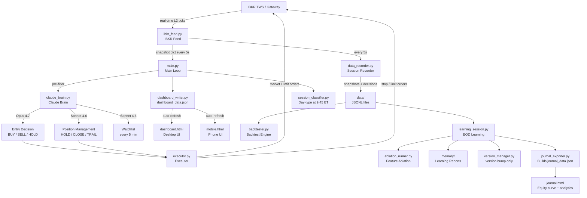
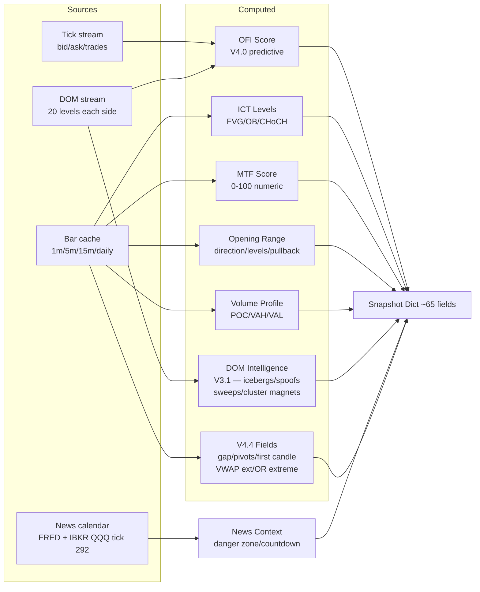
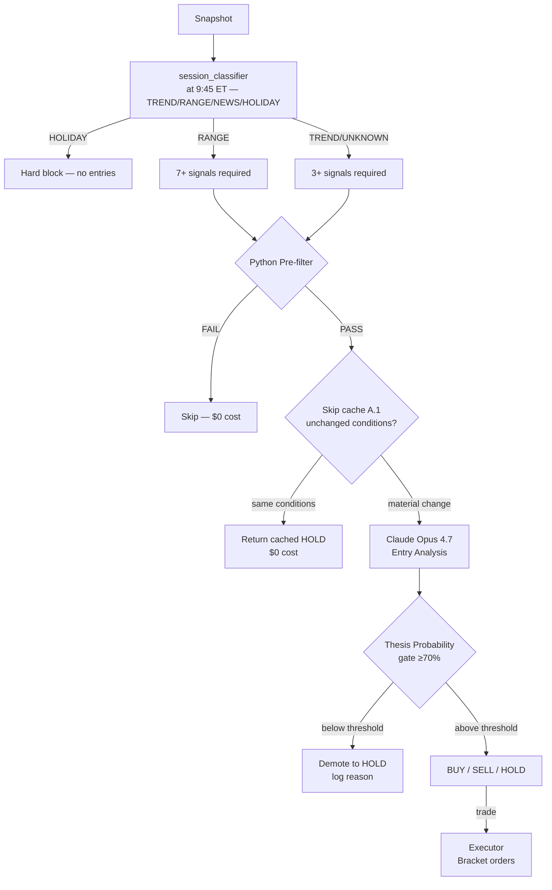
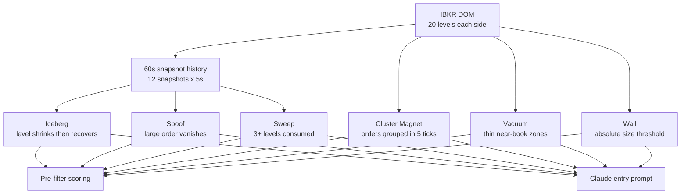
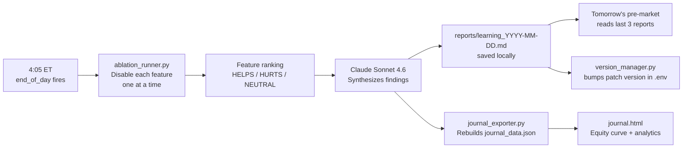
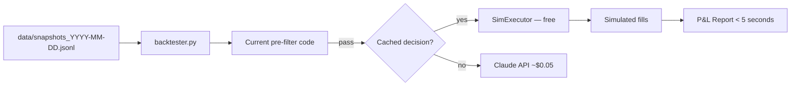
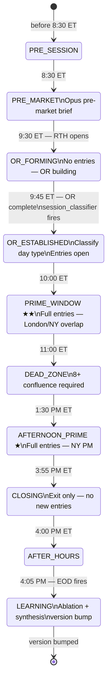

# MNQ AI Trader

An institutional-grade AI-driven futures trading bot for **MNQ (Micro E-Mini Nasdaq-100)** using **ICT (Inner Circle Trader) methodology**, **Opening Range Breakout (ORB)** strategy, and **Claude AI** for entry decisions and position management.

> **Status:** Paper trading — production-ready architecture, not yet live money.  
> **Account:** $50,000 simulated | **Max daily loss:** configurable via `MAX_DAILY_LOSS_PCT` in `.env` (default 20% = $10,000) | **Max size:** `MAX_CONTRACTS` env (default 1, up to 4 supported)  
> **Version:** 4.5.0 (auto-managed by `version_manager.py`)

**Highlights in 4.5.0** — real broker commission capture via `commissionReportEvent` (dedupe + reconnect-safe), trade JSONL persistence end-to-end, dashboard + journal commission-source breakdown, **139-test pytest suite** (`make test`/`smoke`/`regression`/`coverage`), migration from `ib_insync` to `ib_async`, DOM raised to 40 levels, 1-second real-time bars, backtester bias seeding + safe `--no-live-claude` default, dashboard reset at pre-market, EOD time shifted to 15:55. Full diff in `CHANGELOG.md`.

**Deeper docs:**
- `CHANGELOG.md` — versioned changelog (4.5.0 entry)
- `CLAUDE.md` — AI-assistant guidance, architecture truth, audit-tag reference
- `PROJECT_SUMMARY.md` — dense technical map (modules, snapshot schema, JSON schemas, invariants)
- `KNOWLEDGE_BASE.md` — academic research on strategy win rates and probability calibration
- `TEST_PLAN.md` — quality roadmap + per-phase punch list (Phase 1-4 complete)
- `ROADMAP.md` — completed work and deferred features

---

## Table of Contents

1. [Architecture Overview](#architecture-overview)
2. [Data Flow](#data-flow)
3. [Strategy](#strategy)
4. [DOM — Order Book Intelligence](#dom--order-book-intelligence)
5. [AI Decision Making](#ai-decision-making)
6. [Predictive Features](#predictive-features)
7. [Feature Flags](#feature-flags)
8. [EOD Learning System](#eod-learning-system)
9. [File Reference](#file-reference)
10. [Configuration](#configuration)
11. [Setup & Running](#setup--running)
12. [Dashboard](#dashboard)
13. [Mobile Dashboard](#mobile-dashboard)
14. [Backtesting](#backtesting)
15. [Risk Management](#risk-management)
16. [Session Lifecycle](#session-lifecycle)
17. [Version History](#version-history)

---

## Architecture Overview

Three concurrent threads plus a pre-market sleep block:



### Three Concurrent Threads

| Thread | Cadence | Purpose |
|---|---|---|
| Protection loop | 5 s | Stop/target checks, broker reconciliation, orphan detection |
| Entry scan (main thread) | 5 s | Python pre-filter → Claude Opus entry decisions |
| Fast dashboard ticker | 1 Hz | Writes `price_data.json`, patches `dashboard_data.json` every 10 s |

**Pre-market sleep** (`_wait_for_market_hours()`) blocks the process before IBKR connects. It polls every 30 min during off-hours (nights, weekends, CME holidays, early closes) and writes `botSleeping=true` to the dashboard. The bot auto-starts at **8:20 ET** (10 min before pre-market analysis at 8:30 ET).

---

## Data Flow

### Snapshot Assembly (every 5 seconds)



### Entry Decision Flow



---

## Strategy

### Opening Range Breakout (ORB) — V3.0 Bidirectional

Based on Zarattini, Barbon & Aziz (2024). The OR is the first 15 minutes of RTH (9:30–9:45 ET) — three 5-min bars. The range high and low act as structural reference, not a hard gate.

**OR bias rules:**

| Condition | Bias |
|---|---|
| 0–90 min, thesis intact | LONG_PREFERRED or SHORT_PREFERRED |
| MTF fully disagrees | → NEUTRAL immediately |
| > 90 min + price/CHoCH/MTF all against OR | → NEUTRAL |
| Price 80+ pts against OR | → NEUTRAL |
| NEUTRAL | Both BUY and SELL eligible |

**Three-stage ORB entry:**
1. Confirmed CLOSE outside OR (not a wick)
2. Price pulls back toward OR level
3. 1-min CHoCH confirms pullback complete → enter

### Session Type Routing (V4.4)

At OR_ESTABLISHED (9:45 ET), `session_classifier.py` classifies the day:

| Type | Detection | Bot Behavior |
|---|---|---|
| TREND | OR range ≥50pts + MTF aligned + rel vol ≥90% | Normal thresholds (3 signals) |
| RANGE | OR range ≤35pts OR DOJI OR MTF conflicted | 7 signals required; VWAP_REVERSION preferred |
| NEWS | Gap ≥100pts OR active danger zone | Thesis gate raised to 80%; max 1 trade |
| HOLIDAY | Volume < 50% of 20-day avg | Hard block — no entries |
| UNKNOWN | Doesn't fit cleanly | 5 signals required (conservative) |

### ICT Concepts

| Concept | What it is | How the bot uses it |
|---|---|---|
| **FVG** | 3-candle imbalance zone | Entry zone for pullbacks |
| **OB** | Last candle before impulsive move | Support/resistance anchor |
| **CHoCH** | HH/HL or LH/LL structural break | Entry confirmation |
| **Liquidity pools** | Old highs/lows, equal highs | Price targets |
| **Inducement** | Retail stop-hunt before real move | Wait signal |

### Session Levels

Computed in `_update_session_levels()` in `ibkr_feed.py` and injected into the snapshot each cycle:

| Level | Source |
|---|---|
| Session high / low | Rolling intraday extremes |
| OR high / low | First 15 minutes of RTH (9:30–9:45 ET) |
| VWAP | Volume-weighted average price |
| Previous day high / low | From daily bar cache |
| Previous week high / low | Calculated from daily bar cache — weekly liquidity reference |
| Premarket high / low | 4am–9am ET globex extremes. Pre-filter adds 4 signals. |
| Daily demand/supply zones | `daily_zones` — demand and supply zones from `_find_daily_zones()`. Pre-filter +1 each. |
| Candle patterns | Detected on 1m/5m bars: engulfing, hammer, shooting star, morning/evening star, inside-bar breakout. |
| Tape bias | `AGGRESSIVE_BUYING` / `AGGRESSIVE_SELLING` / `NEUTRAL` from large-print rolling counts. Pre-filter ±2 signals. |
| First candle levels (V4.4) | 9:30 1-min H/L and 9:30–9:35 5-min H/L. Named fields in snapshot. |
| Gap classification (V4.4) | Overnight gap size/direction, fill probability (79%/52%/28%/12% by size bracket). |
| Pivot points (V4.4) | Classic daily R1/R2/S1/S2 from prior day OHLC. Pre-filter +1 bear near R2, +1 bull near S2. |
| VWAP extension (V4.4) | Signed/absolute distance from VWAP. Used by dead zone VWAP magnet and pre-filter. |

### Pre-filter Signal Scoring

Pure Python — zero AI cost. Scores bull and bear independently. Claude is only called when the score clears the threshold.

**Signals by weight:**

| Signal | Bull | Bear | Score |
|---|---|---|---|
| DOM sweep (aggressive buying/selling) | ✓ | ✓ | +2 |
| CHoCH confirmation | ✓ | ✓ | +2 |
| Above/below OR level | ✓ | ✓ | +2 |
| OFI STRONG signal | ✓ | ✓ | +2 |
| Entry zone active | ✓ | ✓ | +2 |
| Tape bias (aggressive) | ✓ | ✓ | +2 |
| Bullish/bearish candle pattern at OB/FVG | ✓ | ✓ | +2 |
| OR 2x extension fade (Phase 2) | ✓ | ✓ | +2 |
| VWAP reversion extended (Phase 2) | ✓ | ✓ | +2 |
| Opening drive rejection fade (Phase 3) | ✓ | ✓ | +2 |
| OFI BUY/SELL signal | ✓ | ✓ | +1 |
| OFI accelerating | ✓ | ✓ | +1 |
| Above/below VWAP | ✓ | ✓ | +1 |
| Delta trend aligned | ✓ | ✓ | +1 |
| MTF aligned/partial | ✓ | ✓ | +1 |
| DOM imbalance | ✓ | ✓ | +1 |
| Iceberg bid/ask nearby | ✓ | ✓ | +1 |
| Cluster magnet nearby | ✓ | ✓ | +1 |
| Volume profile breakout | ✓ | ✓ | +1 |
| Near premarket high/low | ✓ | ✓ | +1 |
| Near daily demand/supply zone | ✓ | ✓ | +1 |
| Near pivot R2 (bear) / S2 (bull) | ✓ | ✓ | +1 |
| Gap fill probability ≥52% | ✓ | ✓ | +1 |
| Morning/evening star candle | ✓ | ✓ | +1 |
| OR-aligned candle pattern | ✓ | ✓ | +1 |
| DOM sweep reversal (Phase 3) | ✓ | ✓ | +1 |
| Post-news window (Phase 3) | ✓ | ✓ | +1 |

**Pass threshold:** 3+ signals on bias-preferred side, 5+ to go counter-bias or on DOJI OR days. RANGE days require 7+ signals regardless of direction.

---

## DOM — Order Book Intelligence

### V3.1 — Full 20 Levels + Advanced Detection



### MNQ Size Thresholds

| Size | Label | Meaning |
|---|---|---|
| 1–29 ct | Normal | Retail flow |
| 30–74 ct | Significant | Active participant |
| 75–199 ct | Large / Wall | Institutional |
| 200+ ct | Whale | Dominant order |

### Detection Algorithms

**Iceberg** — Level shrinks then recovers to 70%+ of original. Hidden quantity keeps refreshing. Treated as stronger S/R than visible size suggests.

**Spoof** — Large order (≥75 ct) appears then vanishes without trading. Detected across 3 snapshots. Claude is told to ignore this level for directional bias.

**Sweep** — 3+ significant levels consumed between snapshots. Ask sweep = aggressive buyers. Scores +2 in pre-filter (same weight as CHoCH).

**Cluster Magnet** — Groups of large orders within 5 ticks (1.25 pts). When cluster total ≥150 ct, flagged as a price target. More reliable than single large orders.

---

## AI Decision Making

### Model Allocation

| Decision | Model | Est. cost | When |
|---|---|---|---|
| Watchlist | Sonnet 4.6 | ~$0.011 | Every 5 min |
| Entry analysis | Opus 4.7 | ~$0.05 | Pre-filter pass (skip-cache reduces by ~60–70%) |
| Position management | Sonnet 4.6 | ~$0.006 | Every 15–60 s while in trade |
| Pre-market brief | Opus 4.7 | ~$0.015 | Once at 8:30 ET |
| EOD learning synthesis | Sonnet 4.6 | ~$0.02 | Once at 4:05 ET |

### Cost Optimizations

**A.1 Skip-when-unchanged:** If Opus returned HOLD and price has moved <5 pts, no new bar closed, watchlist is fresh, and <3 min elapsed → return the cached decision for free. Targets ~60–70% Opus call reduction.

**Prompt caching:** The static system prompt (~2,500 tokens) and watchlist block (~800 tokens) carry Anthropic cache markers. Only the dynamic snapshot block is billed at full rate per call.

**A.3 Per-call cost tracking:** Every API call logs `cost=$X.XXXX session_total=$X.XX` to the log file.

### What Claude Sees (Entry Prompt)

```
SYSTEM: ICT methodology, bidirectional framework, thesis probability
        calibration guide, DOM interpretation rules (cached)

SESSION_TYPE: TREND/RANGE/NEWS/HOLIDAY/UNKNOWN + context string (V4.4)

CACHED:
  Active watchlist (dual-sided: bull + bear setups, key levels)
  Stable session context (OR direction, pullback levels)

DYNAMIC:
  Performance stats | Last 3 days learning findings (FEATURE_LEARNING_INJECT)
  MNQ MARKET SNAPSHOT — HH:MM ET
    Kill Zone | AMD | HTF Bias
    MTF Alignment + Score (0-100)
    ICT Levels (FVGs, OBs, CHoCH, liquidity pools)
    Economic Calendar + IBKR live headlines (QQQ tick 292)
    Gap classification + fill probability (V4.4)
    Daily pivot points R1/R2/S1/S2 (V4.4)
    Price | VWAP | VWAP extension (V4.4) | Volume Profile | POC
    OFI Score (-100 to +100) + signal + acceleration + divergence
    Delta Trend (true bid/ask classification or approximation)
    DOM (20 levels + iceberg/spoof/sweep/cluster signals)
    Candle patterns (1m + 5m) | Tape bias | Daily zones
    Recent 1-min candles | Risk state | Session levels
```

---

## Predictive Features

### Session Type Classifier (V4.4)

`session_classifier.py` fires once at OR_ESTABLISHED (9:45 ET). Result stored module-level and injected into every Claude entry and watchlist prompt for the rest of the session.

- **TREND** → ORB pullbacks and continuation preferred. Normal thresholds (3 signals).
- **RANGE** → 7 signals required. VWAP_REVERSION and OR_EXTREME_FADE preferred (academic edge 72–78%).
- **NEWS** → Thesis gate raised to 80% in prompt. Max 1 trade suggestion.
- **HOLIDAY** → Hard block in `can_enter()` — zero entries all day.
- **UNKNOWN** → Conservative: 5 signals required.

Classification resets at EOD via `set_session_type(SessionType.UNKNOWN)`.

### Thesis Probability Gate (V4.0)

Claude outputs `THESIS_PROBABILITY: 0-100` with every entry decision. Entries below `MIN_THESIS_PROBABILITY` (default 70) are automatically demoted to HOLD before reaching the executor.

**Calibration guide:**
- **90–100:** Everything aligned — rare, highest conviction
- **75–89:** Strong setup — normal entry range
- **60–74:** Marginal — only acceptable in prime kill zones
- **0–59:** No trade — demoted to HOLD automatically

### Order Flow Imbalance (OFI) (V4.0)

Computed from the 60-second DOM history using Cont, Kukanov & Stoikov (2014) methodology:

```
OFI = Σ (ΔBid - ΔAsk) over last 12 snapshots
```

Positive OFI = net buying pressure. Negative = net selling.

**Output fields:**
- `score`: -100 to +100 normalized
- `signal`: STRONG_BUY / BUY / NEUTRAL / SELL / STRONG_SELL
- `acceleration`: ACCELERATING / DECELERATING / STABLE
- `divergence`: True if OFI disagrees with price direction

**Pre-filter:** STRONG_BUY/SELL = +2 points, BUY/SELL = +1, ACCELERATING = +1.

### Gap Classification (V4.4)

Computes the overnight gap between previous close and today's open at session start.

| Gap Size | Fill Probability | Pre-filter |
|---|---|---|
| < 63 pts | 79% | +1 counter-gap direction |
| 63–147 pts | 52% | +1 counter-gap direction |
| 147–210 pts | 28% | No signal |
| > 210 pts | 12% (news) | Session classified NEWS |

### IBKR Live News (tick 292)

Subscribed via QQQ ETF (futures don't support news ticks natively). When IBKR delivers a Nasdaq-relevant headline, the last 10 headlines are stored and the latest 3 are injected into Claude's entry prompt.

Requires an IBKR news subscription (e.g. Briefing.com). Silently does nothing without one.

---

## Feature Flags

All 26 feature flags can be toggled in `.env` for live trading or ablation testing. Safety systems (stops, race condition fixes, broker reconciliation, position limits) are hardcoded and never flagged.

```env
# Strategy / Bias
FEATURE_ORB_BIAS=true           # OR direction as starting bias
FEATURE_BIDIRECTIONAL=true      # Allow shorts on bull OR days (and longs on bear)
FEATURE_BIAS_DECAY=true         # Bias decays to NEUTRAL after 90 min
FEATURE_DOJI_MTF_OVERRIDE=true  # On DOJI OR days, allow trades when MTF is strongly aligned (5+ signals)

# Predictive Signals
FEATURE_OFI=true                # Order Flow Imbalance score from DOM history
FEATURE_DOM_ADVANCED=true       # Iceberg/spoof/sweep/cluster detection (20 levels)
FEATURE_MTF_SCORE=true          # Numeric MTF alignment score (0-100)
FEATURE_DELTA_LIVE=true         # True bid/ask delta classification

# Entry Gates
FEATURE_THESIS_GATE=true        # Thesis probability threshold gate (default 70%)
FEATURE_R_BUDGET=false          # Session R-loss cap — off for paper (data collection), on for live money
FEATURE_NEWS_GATE=true          # Block entries within danger window around high-impact news
FEATURE_DEAD_ZONE=true          # Require 8+ confluence during dead zone (11am–1:30pm ET)

# Position Management
FEATURE_DUAL_TRAIL=true         # Claude TRAIL decisions anchor auto-trail (Claude always wins)
FEATURE_EARLY_EXIT=true         # Allow Claude to CLOSE positions early before stop/target

# Learning
FEATURE_LEARNING_EOD=true       # Run ablation backtest + Claude synthesis at 4:05 ET
FEATURE_LEARNING_INJECT=true    # Inject last 3 session findings into next day's pre-market prompt

# V4.4 Phase 1 — Active by default
FEATURE_SESSION_CLASSIFIER=true # Classify day as TREND/RANGE/NEWS/HOLIDAY at 9:45 ET
FEATURE_FIRST_CANDLE_LEVELS=true  # Track first 1-min and 5-min candle H/L
FEATURE_GAP_CLASSIFICATION=true # Compute overnight gap + fill probability
FEATURE_PIVOT_POINTS=true       # Daily R1/R2/S1/S2 from prior day OHLC; +1 near R2/S2

# V4.4 Phase 2 — Gated (activate after data confirms accuracy)
FEATURE_OR_EXTREME_FADE=false       # 2x OR range extension fade (+2 signals)
FEATURE_DEAD_ZONE_VWAP_MAGNET=false # Lower dead zone threshold when 60+ pts from VWAP
FEATURE_VWAP_REVERSION=false        # VWAP extension signals for range days (+2)

# V4.4 Phase 3 — Gated (activate after data confirms accuracy)
FEATURE_SWEEP_REVERSAL=false        # Extra +1 pre-filter weight on DOM sweeps
FEATURE_OPENING_DRIVE_FADE=false    # First 5-min candle rejection wick fade (+2)
FEATURE_POST_NEWS_REFRESH=false     # Refresh watchlist 45 min after high-impact news
```

---

## EOD Learning System

At **4:05 ET** (when `EOD_SCHEDULE_TIME` fires), the `end_of_day()` routine closes any open positions, saves the session summary, and — when `FEATURE_LEARNING_EOD=true` — kicks off the automated learning pipeline:



### Ablation Testing

Each feature is disabled one at a time and the backtest is re-run to measure its isolated contribution:

```
Baseline (all ON):  4T  75%WR  +$42.00

Removing each feature:
  OFI Score         3T  67%WR  +$28.00  → Contribution: +$14.00  HELPS
  DOM Advanced      4T  75%WR  +$35.00  → Contribution: +$7.00   HELPS
  Dead Zone         5T  60%WR  +$48.00  → Contribution: -$6.00   HURTS
  Thesis Gate       6T  50%WR  +$12.00  → Contribution: +$30.00  HELPS
  ...
```

Reports saved to `reports/` (git-ignored) and `memory/` (for pre-market injection).

### Soft Learning

Claude's synthesis is injected into the next day's pre-market prompt:

```
LEARNING FROM RECENT SESSIONS
2026-05-27:
  OFI was strongly predictive on trend days but noisy during chop.
  DOM sweeps preceded all 3 winning trades. Dead zone entries
  underperformed — consider raising threshold to 8+ signals.
```

Learning is **soft** — Claude reads the findings and adjusts its reasoning. No automatic `.env` changes are made.

### Auto-versioning

Every EOD run bumps the patch version in `.env`:

```
4.4.1  → current release
4.4.2  → after first EOD learning session
4.4.3  → next session
...
4.5.0  → new feature shipped (minor bump, done manually)
5.0.0  → architectural change (major bump, done manually)
```

---

## File Reference

### Core Bot

| File | Purpose |
|---|---|
| `main.py` | Entry point. Session state machine (`SessionState` enum), `run_cycle`, pre-market orchestration, EOD routine, fast dashboard ticker, event-driven position trigger (`_should_call_claude_now`). Session classifier fires at OR_ESTABLISHED. |
| `claude_brain.py` | All Anthropic API calls. Entry analysis (Opus), position management (Sonnet), watchlist updates (Sonnet), pre-market analysis (Opus). Session type injected into all prompts. Holds per-session module state wiped at EOD via `reset_session_state()`. |
| `ibkr_feed.py` | IBKR connection and snapshot assembly (~65-field dict). Bars fetched once at startup then updated via `reqRealTimeBars`. DOM streaming (20 levels, 60s history). OFI engine. OR tracking. IBKR news via QQQ tick 292. V4.4: gap classification, pivot points, first candle levels, VWAP extension, OR extreme fade, opening drive detection, post-news window. |
| `executor.py` | Order placement and position tracking. Bracket orders (entry + stop + limit target), protection loop, R-budget enforcement, dual-control trailing (`_claude_trail_stop`), broker reconciliation, cancel-vs-fill race fix. |
| `config.py` | All configuration. Reads `.env`, exposes ~120 typed constants across 20+ sections, 26 feature flags, `get_active_features()`, `features_summary()`. |
| `session_classifier.py` | Day-type classifier. Fires once at OR_ESTABLISHED (9:45 ET). Returns TREND/RANGE/NEWS/HOLIDAY/UNKNOWN. Injects context string into all Claude prompts. HOLIDAY hard-blocks all entries. |

### Support Modules

| File | Purpose |
|---|---|
| `dashboard_writer.py` | Writes `dashboard_data.json` with merge logic (fast ticker patches don't wipe Claude reasoning). Atomic write via temp+replace. Includes version, thesis probability, IBKR headlines, `botSleeping`/`wakeTime` fields. |
| `memory_manager.py` | Session memory. Loads last 5 days, saves EOD summary, generates morning review. |
| `news_calendar.py` | Economic calendar. FRED + hardcoded recurring events. Danger-zone gating, countdown to next event. |
| `strategy_stats.py` | Per-strategy win rate / expectancy tracking. Wilson 95% CI. Requires 20+ trades to activate weighting. |
| `data_recorder.py` | Records every snapshot and Claude decision to JSONL. Enabled by `RECORDING_ENABLED=true`. |
| `backtester.py` | Replay engine. Runs current code against recorded sessions. Uses cached Claude decisions by default. |
| `notifier.py` | Pushover iPhone push notifications. Trade entered/exited, stop→BE, EOD summary, IBKR events, loss warnings, errors. Optional — bot runs normally without keys. |
| `watchdog.py` | Standalone health monitor. Run in a separate terminal. Sends Pushover alert if `main.py` process disappears or dashboard file goes stale (>120s). Checks IBKR Gateway port every 30s. |

### EOD Learning Modules

| File | Purpose |
|---|---|
| `version_manager.py` | Auto-versioning. Reads/writes `BOT_VERSION` in `.env`. Bump manually: `py -3.11 version_manager.py --bump minor`. |
| `ablation_runner.py` | Disables each feature flag one at a time, re-runs backtest, returns HELPS / HURTS / NEUTRAL ranking. |
| `learning_session.py` | EOD orchestrator. Runs ablation → Claude synthesis → saves reports → bumps version → exports journal. |
| `journal_exporter.py` | Rebuilds `journal_data.json` from all `decisions_*.jsonl` files. Equity curve, per-strategy stats, by-hour breakdown, OFI performance, thesis probability buckets. |

### Static Files

| File | Purpose |
|---|---|
| `dashboard.html` | Desktop browser UI. Three-column layout, polls `dashboard_data.json` + `price_data.json` every 2 s. |
| `mobile.html` | iPhone-optimized UI. Single column, big text, polls every 5 s. Add to home screen via Safari → Share. Shows `BOT SLEEPING` with wake time when dormant. |
| `journal.html` | EOD analytics. Equity curve, full trade log, per-strategy/hour/OFI/thesis breakdowns, edge analysis, weekly R:R. Reads `journal_data.json`. Version pulled live from `dashboard_data.json`. |
| `requirements.txt` | Python dependencies (see [Install](#install)). |
| `.env` | API keys and config overrides. **Never commit.** |

### Generated at Runtime (not committed)

| Path | Contents |
|---|---|
| `logs/` | Rotating log files — flushed immediately after BUY/SELL/CLOSE (C.4) |
| `memory/` | JSONL session summaries + `tick_state.json` (same-day restore) + learning reports |
| `data/` | `snapshots_YYYY-MM-DD.jsonl` and `decisions_YYYY-MM-DD.jsonl` — backtester input |
| `reports/` | Learning and ablation reports — git-ignored |
| `dashboard_data.json` | Live dashboard state — deleted on every fresh `main.py` boot (C.6) |
| `price_data.json` | Fast ticker price cache |

---

## Configuration

### Required

```env
ANTHROPIC_API_KEY=sk-ant-...
```

### Common Settings

```env
# IBKR
IBKR_HOST=127.0.0.1
IBKR_PORT=7497              # TWS paper=7497, Gateway paper=4002
IBKR_CLIENT_ID=1

# Contract — update quarterly when MNQ rolls (Mar/Jun/Sep/Dec)
CONTRACT_EXPIRY=20260618
CONTRACT_CONID=770561201

# Data
LIVE_DATA_ACTIVE=true       # Requires CME L1+L2 subscription

# Risk
ACCOUNT_SIZE=50000
MAX_DAILY_LOSS_PCT=0.20     # 20% of account = $10,000 default (override as needed)
MAX_SESSION_R_LOSS=3.0      # Stop after 3R lost in session (FEATURE_R_BUDGET must be true)
MAX_CONTRACTS=1

# AI Models
CLAUDE_ENTRY_MODEL=claude-opus-4-7
CLAUDE_POSITION_MODEL=claude-sonnet-4-6
CLAUDE_USE_CACHING=true

# V4.0
MIN_THESIS_PROBABILITY=70   # Block entries below this confidence

# V4.1
BOT_VERSION=4.5.0           # Auto-managed by version_manager.py
RECORDING_ENABLED=true

# V4.5.0 — Night Owl (24/7 scanning)
NIGHT_OWL=false             # true = skip session gates & overnight sleep
                            #        pre-market still fires at 08:30 ET
                            #        EOD still fires at EOD_SCHEDULE_TIME
                            #        Risk caps unchanged
```

### Advanced Tuning

All constants below are in `config.py` and overridable via `.env`. Defaults are production-tested — only adjust when ablation data or live session logs indicate a specific issue.

**Session Times (HHMM integers)**

```env
SESSION_PRE_MARKET_TIME=830       # Pre-market analysis fires at 8:30 ET
SESSION_MARKET_OPEN_TIME=930      # RTH open, OR begins forming
SESSION_OR_FORMING_END=945        # OR established (end of 15-min OR window)
SESSION_OR_ESTABLISHED_END=1000   # 10:00 ET — end of OR-established window
SESSION_PRIME_WINDOW_END=1100     # NY AM prime window ends
SESSION_DEAD_ZONE_END=1330        # Dead zone ends, PM prime begins
SESSION_AFTERNOON_PRIME_END=1555  # PM prime ends, closing window begins (.env override)
SESSION_CLOSING_END=1600          # RTH close
EOD_SCHEDULE_TIME=16:05           # Positions closed, EOD routine fires (.env override)
MAIN_LOOP_SLEEP_SECS=0.5          # Main cycle sleep between ticks
```

**Entry Gates**

```env
DEAD_ZONE_CONFLUENCE_THRESHOLD=8  # Signals required to enter during dead zone (11am–1:30pm)
ENTRY_MODE=LIMIT                  # "LIMIT" tries limit order first; "MARKET" always MKT
LIMIT_ORDER_MAX_SLIPPAGE=4        # Ticks — falls back to MKT if price moves this far
LIMIT_ORDER_TIMEOUT_SECS=5        # Seconds before unfilled limit is cancelled → MKT
```

**Pre-filter Signal Scoring**

```env
PRE_FILTER_SIGNAL_THRESHOLD=3     # Signals needed on bias-preferred side
COUNTER_TREND_SIGNAL_THRESHOLD=5  # Signals needed counter-bias or DOJI override
SESSION_RANGE_SIGNAL_THRESHOLD=7  # Signals needed on RANGE days (session classifier)
```

**V4.4 Session Classifier**

```env
SESSION_CLASSIFIER_TREND_OR_MIN=50   # OR range pts minimum for TREND classification
SESSION_CLASSIFIER_RANGE_OR_MAX=35   # OR range pts maximum for RANGE classification
SESSION_CLASSIFIER_NEWS_GAP_MIN=100  # Gap pts that flags NEWS day
SESSION_NEWS_THESIS_GATE=80          # Min thesis probability on NEWS days
```

**V4.4 Gap Classification**

```env
GAP_SMALL_THRESHOLD=63       # Below this = 79% fill probability
GAP_MEDIUM_THRESHOLD=147     # 63-147 = 52% fill probability
GAP_LARGE_THRESHOLD=210      # 147-210 = 28%; above = 12% (news gap)
```

**V4.4 Phase 2 Thresholds**

```env
VWAP_REVERSION_MIN_EXTENSION=80     # Points from VWAP to trigger reversion signal
OR_EXTREME_FADE_MULTIPLIER=2.0      # x OR range = extreme zone
DEAD_ZONE_VWAP_MAGNET_MIN_EXT=60    # Points from VWAP to lower dead zone threshold
DEAD_ZONE_VWAP_MAGNET_THRESHOLD=6   # Reduced dead zone threshold when VWAP magnet active
```

**V4.4 Phase 3 Thresholds**

```env
OPENING_DRIVE_MIN_POINTS=80         # First 5-min candle range to classify as drive
OPENING_DRIVE_REJECTION_PCT=0.60    # Wick as % of body to flag rejection
POST_NEWS_WINDOW_MINUTES=45         # Minutes after news before window opens
POST_NEWS_WINDOW_DURATION=30        # How long post-news window stays open
```

**Skip-Cache (A.1)**

```env
SKIP_CACHE_PRICE_DELTA=5.0        # Price move (pts) that forces a fresh Claude call
SKIP_CACHE_MAX_AGE_SECS=180       # Max cache age before forced refresh (3 min)
SKIP_CACHE_WATCHLIST_AGE_SECS=60  # Watchlist staleness that invalidates cache
```

**OR / Bias**

```env
OR_THESIS_INVALIDATION_POINTS=80  # Price distance that flips OR bias to NEUTRAL
OR_PULLBACK_THRESHOLD_PCT=0.3     # Pullback % of OR range to arm ORB entry
FEATURE_DOJI_MTF_OVERRIDE=true    # On DOJI OR days, allow trades when MTF is BULLISH/BEARISH_ALIGNED
```

**Auto-Trail Milestones (executor.py — D.2)**

```env
TRAIL_PROFIT_1_TICKS=120   # Ticks profit → trigger milestone-1 trail
TRAIL_PROFIT_1_LOCK=30     # Ticks above entry to lock stop at milestone 1
TRAIL_PROFIT_2_TICKS=180   # Ticks profit → trigger milestone-2 trail
TRAIL_PROFIT_2_LOCK=60     # Ticks above entry to lock stop at milestone 2
```

Breakeven move happens at +50 ticks. Auto-trail never moves the stop looser than Claude's last explicit TRAIL decision (`_claude_trail_stop` — D.2).

**DOM Signal Thresholds**

```env
DOM_HISTORY_MAX_SNAPSHOTS=12      # Rolling DOM history depth (12 × 5s = 60s)
DOM_SIGNIFICANT_SIZE=30           # Min size to flag as significant
DOM_LARGE_SIZE=75                 # Institutional / wall threshold
DOM_WHALE_SIZE=200                # Dominant order threshold
DOM_BUY_PRESSURE_BULL_THRESHOLD=0.65   # DOM buy ratio for bull signal
DOM_SELL_PRESSURE_BEAR_THRESHOLD=0.35  # DOM buy ratio for bear signal
DOM_CLUSTER_TOLERANCE_POINTS=1.25      # Grouping tolerance for cluster magnet
DOM_ICEBERG_SHRINK_PCT=0.6             # Size shrink % to flag iceberg
DOM_ICEBERG_RECOVERY_PCT=0.7           # Recovery % to confirm iceberg
DOM_SWEEP_LEVEL_THRESHOLD=3            # Levels consumed to call a sweep
```

**OFI Thresholds**

```env
OFI_STRONG_THRESHOLD_CONTRACTS=500   # Raw OFI magnitude for STRONG signal
OFI_ACCELERATION_THRESHOLD=1.3       # OFI ratio to call ACCELERATING
OFI_STRONG_BUY_THRESHOLD=60          # Normalized score for STRONG_BUY
OFI_BUY_THRESHOLD=25                 # Normalized score for BUY
OFI_STRONG_SELL_THRESHOLD=-60        # Normalized score for STRONG_SELL
OFI_SELL_THRESHOLD=-25               # Normalized score for SELL
```

**Executor Safety**

```env
PROTECTION_RECONCILE_EVERY_N_LOOPS=4       # Broker reconcile every N protection loops (~20s)
MAX_REASONABLE_PNL_PER_CONTRACT=1000.0     # P&L sanity bound — rejects impossible values
RBUST_MAX_R_PER_TRADE=1.5                  # Max R gain per trade (R-budget cap)
SIMULATE_COMMISSIONS=false                  # Set true to simulate $0.85/side in paper P&L
COMMISSION_PER_SIDE_USD=0.85               # IBKR MNQ all-in rate
```

---

## Setup & Running

### Prerequisites

```
Python 3.11
IBKR TWS or IB Gateway (paper trading enabled, API connections on)
CME real-time L1+L2 subscription (or set LIVE_DATA_ACTIVE=false)
Anthropic API key with Opus access
```

### Install

```bash
pip install -r requirements.txt
```

Or manually:

```bash
pip install ib_async anthropic pandas pytz python-dotenv schedule exchange-calendars
pip install pytest pytest-cov   # required for the test suite (see Testing below)
```

> v4.5.0 migrated from `ib_insync` (unmaintained) to `ib_async` (community fork, drop-in API). If you have an old environment with `ib_insync` installed, remove it: `pip uninstall ib_insync`.

`exchange-calendars` (XNYS calendar) enables CME holiday and early-close detection (Memorial Day, July 4th, Thanksgiving, Christmas Eve). Without it the bot falls back to weekend-only gating and logs a warning.

### Push Notifications (optional — V4.3)

`notifier.py` sends iPhone push alerts via Pushover for all key bot events: pre-market ready, OR established, trade entered/exited, stop→BE, EOD summary, IBKR connect/disconnect, loss warnings, errors, bot sleeping/awake.

```env
PUSHOVER_USER_KEY=u-your-user-key
PUSHOVER_API_TOKEN=a-your-app-token
NOTIFY_ENABLED=true
```

Get keys at `pushover.net` (one-time $5 per platform). Without keys, notifications are silently disabled — bot runs normally.

### Run

```bash
# Terminal 1 — the bot (boot at 8:20 ET, 10 min before pre-market)
py -3.11 main.py

# Terminal 2 — dashboard server (desktop and mobile)
py -3.11 -m http.server 8080 --bind 0.0.0.0

# Terminal 3 (optional) — health watchdog
py -3.11 watchdog.py
```

Or use `start_trading.bat` to launch both with one double-click.

### Daily Workflow

```
Pre-session checklist (run before booting):
  make smoke                          # 10 tests, ~2s — must be green
  Verify .env: model, MAX_CONTRACTS, MIN_THESIS_PROBABILITY, FEATURE_DEAD_ZONE

8:20 ET  → py -3.11 main.py  (bot boots, connects IBKR, caches bars)
8:30 ET  → Pre-market analysis — injects last 3 learning reports
           (dashboard_data.json cleared once-per-day at this boundary)
9:30 ET  → OR begins forming, scanning paused
9:45 ET  → OR complete → session classifier fires + entries unlock
10:00 ET → PRIME_WINDOW begins — full scanning active
11:00 ET → DEAD_ZONE — entries require 8+ confluence (when FEATURE_DEAD_ZONE=true)
                                    OR pass through (when FEATURE_DEAD_ZONE=false)
13:30 ET → NY PM PRIME window — full scanning resumes
15:30 ET → CLOSING — exit only, no new entries
15:55 ET → EOD fires: close positions, save memory, run learning session
           (ablation → Claude synthesis → version bump → journal export)
```

---

## Testing

v4.5.0 ships with a **139-test pytest suite** across 14 files. The Makefile
exposes four targets:

```
make test          # full suite — 139 tests, ~3 min
make smoke         # 10 tests, ~2s — import / config / dashboard
make regression    # 14 tests, ~25s — one per fixed bug (BUG-001 to BUG-010)
make coverage      # full suite + line coverage report (terminal + htmlcov/)
```

Coverage as of v4.5.0: **29% overall**, 5420 statements across 15 modules.
Highlights:

| Module | Coverage | Notes |
|---|---|---|
| `config.py` | **93%** | env-read paths tested |
| `journal_exporter.py` | **83%** | full trade emission + commission sources |
| `notifier.py` / `dashboard_writer.py` | 65 / 58% | mid-range |
| `data_recorder.py` / `backtester.py` | 56 / 52% | mid-range |
| `claude_brain.py` | 39% | large module, parse + pre_filter covered |
| `executor.py` | 26% | IBKR-coupled; mock harness pending |
| `ibkr_feed.py` | 5% | almost all live-IBKR-coupled |

The 70% long-term target requires an IBKR mock harness for the executor
and feed paths — flagged in TEST_PLAN.md Phase 4.

**Discipline:** CLAUDE.md `## Development Discipline` enforces test-before-fix,
and `## Pre-Commit Checklist` requires green tests before push.

---

## Dashboard

### Desktop — `dashboard.html`

`http://localhost:8080/dashboard.html` — Three-column layout:

```
┌─────────────────────────────────────────────────────────┐
│ MNQ/AI v4.4  29,680.75  [SCANNING][FLAT][AM PRIME][...] │ 09:47:22 │
├─────────────────────────────────────────────────────────┤
│ [MARKET STATUS] NY AM PRIME ★★  Dead zone in 13m        │
├──────────┬──────────────────────────────┬───────────────┤
│ POSITION │ CLAUDE ANALYSIS              │ MARKET CONTEXT│
│ FLAT     │ [HOLD] PROB 82% SCORE 6/10  │ ▲ BULLISH     │
│ +$0.00   │                              │ HTF BIAS      │
│ STOP  —  │ Reasoning text...            │ ICT LEVELS    │
│ ENTRY —  │ BIAS: SHORT_PREFERRED        │ STRUCTURE     │
│ TARGET — │ RECENT CANDLES               │ SESSION STATS │
└──────────┴──────────────────────────────┴───────────────┘
│ 🟢 No major events — clean technical window              │
└──────────────────────────────────────────────────────────┘
```

**Key features:**
- Market status bar with session countdown and kill-zone label
- `BOT OFFLINE` indicator when bot is stopped
- `BOT SLEEPING` banner with wake time during off-hours
- Thesis probability in color (green ≥75%, yellow 60–74%, red <60%)
- Claude reasoning greys out after 5 minutes (stale indicator)
- Clock uses browser ET time — never stale

---

## Mobile Dashboard

`http://100.x.x.x:8080/mobile.html` via Tailscale. Add to iPhone home screen (Safari → Share → Add to Home Screen) for a native-app feel.

### Tailscale Setup (5 minutes, free)

1. `tailscale.com/download` → install on PC, sign in
2. App Store → "Tailscale" → install on iPhone, sign in with same account
3. Find PC's Tailscale IP in the app (e.g. `100.97.169.17`)
4. iPhone Safari: `http://100.97.169.17:8080/mobile.html`
5. Share → Add to Home Screen

### What It Shows

```
┌─────────────────────┐
│ MNQ/AI v4.4  09:47  │
│                LIVE  │
├─────────────────────┤
│ NY AM PRIME ★★      │
│ Dead zone in 13m    │
├─────────────────────┤
│ 29,680.75           │
│ Bid 29680 / Ask ..  │
├─────────────────────┤
│ FLAT   +$0.00       │
│ Stop — Entry — Tgt— │
├─────────────────────┤
│ [HOLD]              │
│ CONF HIGH PROB 82%  │
│ BIAS: SHORT_PREF    │
│ Reasoning...        │
├─────────────────────┤
│ P&L: +$0  Loss:$10k │
├─────────────────────┤
│ 0T  0W  0L  —%      │
├─────────────────────┤
│ 🟢 No major events  │
└─────────────────────┘
```

Refreshes every 5 seconds. Shows `BOT SLEEPING` in yellow with wake time when dormant.

---

## Remote Access

### WSL2 Remote Access via Tailscale SSH

Since the bot runs on WSL2, you can access the terminal remotely from any device using Tailscale SSH. Useful for checking logs, restarting the bot, or managing OpenClaw without sitting at your PC.

Setup (one time):
```bash
sudo apt install openssh-server -y
sudo service ssh start
```

Then from any device on your Tailscale network:
```bash
ssh fgomecs@100.97.169.17
```

On iPhone use Termius (free, App Store) with your Tailscale IP and SSH credentials.

To make SSH start automatically when WSL2 opens:
```bash
echo "sudo service ssh start" >> ~/.bashrc
```

### OpenClaw Gateway

OpenClaw runs alongside the bot and provides a WhatsApp interface for querying bot status from anywhere. Gateway must be running for Jarvis to respond.

Start the gateway (runs in its own terminal):
```bash
openclaw gateway run
```

Gateway auto-starts on WSL2 boot if configured. Dashboard at http://127.0.0.1:18789 (token required).

Jarvis commands via WhatsApp (send to your own number):
```
Run: cd /mnt/c/trading/mnq-ai-trader && python3 remote_control.py status
Run: cd /mnt/c/trading/mnq-ai-trader && python3 remote_control.py summary
Run: cd /mnt/c/trading/mnq-ai-trader && python3 remote_control.py pnl
Run: cd /mnt/c/trading/mnq-ai-trader && python3 remote_control.py trades
Run: cd /mnt/c/trading/mnq-ai-trader && python3 remote_control.py last_trade
Run: cd /mnt/c/trading/mnq-ai-trader && python3 remote_control.py learning
```

Jarvis memory is loaded from `~/.openclaw/workspace/BOOTSTRAP.md` on every session start. Edit that file to update Jarvis personality or bot context.

---

## Backtesting

### How It Works



Backtesting replays recorded snapshots through the **current version** of the code. When pre-filter logic changes, previously-cached HOLD decisions may no longer apply, triggering a live Claude call for that snapshot (~$0.05 each). Use `--no-live-claude` to block API calls entirely.

### Usage

```bash
py -3.11 backtester.py --list
py -3.11 backtester.py --date 2026-05-27
py -3.11 backtester.py --date 2026-05-27 --verbose
py -3.11 backtester.py --date 2026-05-27 --no-live-claude
```

### Ablation (runs automatically at EOD, or manually)

```bash
py -3.11 ablation_runner.py --date 2026-05-27
```

### Learning Session (runs automatically at EOD, or manually)

```bash
py -3.11 learning_session.py --date 2026-05-27
py -3.11 learning_session.py --date 2026-05-27 --no-commit
```

---

## Risk Management

### Layered Protection

```
Layer 1: Hard daily loss cap (MAX_DAILY_LOSS_PCT × ACCOUNT_SIZE — default $10,000)
Layer 2: R-budget — stop entries after MAX_SESSION_R_LOSS R units lost (FEATURE_R_BUDGET)
Layer 3: Hold-time gate — minimum 3 min scalp / 5 min swing before CLOSE honored
Layer 4: Protection loop — 5s stop/target checks on a dedicated thread
Layer 5: stop_price=0 guard — never triggers on invalid state (P1.7)
Layer 6: Broker reconciliation — detects orphaned positions every ~20s
Layer 7: P&L sanity bound — rejects impossible values > $1,000/trade
Layer 8: Cancel-vs-fill race fix — pre-flight and post-cancel broker position check
```

### Race Condition Fix (V2.5)

When Claude calls CLOSE at the same moment a broker stop fires, the old code would submit a market SELL from flat — opening an accidental short. Fixed with:
1. Pre-flight broker position check before any close
2. Post-cancel recheck before submitting the close order
3. `_infer_recent_exit_fill()` captures realistic exit price from broker fills

### Dual-Control Trailing (V3.0 — D.2)

`_claude_trail_stop` records Claude's explicit TRAIL decisions. Auto-trail milestones (breakeven at +50t, lock +30t at +120t, lock +60t at +180t) can only move the stop **tighter**, never looser than Claude's structural stop. Claude always wins.

---

## Session Lifecycle



### Entry Eligibility by State

| State | Entries | Condition |
|---|---|---|
| PRE_SESSION, PRE_MARKET, OR_FORMING | ✗ | No entries |
| OR_ESTABLISHED | ✓ | Full entries (session type applied) |
| PRIME_WINDOW | ✓ | Full entries (London/NY overlap ★★) |
| DEAD_ZONE | ⚠ | 8+ confluence signals required when `FEATURE_DEAD_ZONE=true` |
| AFTERNOON_PRIME | ✓ | Full entries (NY PM ★) |
| CLOSING | ✗ | Exit only |
| AFTER_HOURS | ✗ | No entries |

---

## Version History

| Version | Date | Key Changes |
|---|---|---|
| V1.0 | 2026-05 | Initial architecture, IBKR connection, basic ORB |
| V2.0 | 2026-05 | Prompt caching, session memory, ICT levels, dashboard |
| V2.5 | 2026-05-22 | **P0 race condition fix** — accidental shorts + phantom P&L |
| V3.0 | 2026-05-22 | Bidirectional bias, dual-sided watchlist, bias decay, backtest recorder, R-budget, dual-control trailing, MTF score |
| V3.1 | 2026-05-22 | **DOM upgrade** — 20 levels, iceberg/spoof/sweep/cluster detection, MNQ absolute thresholds |
| V4.0 | 2026-05-22 | **Predictive features** — thesis probability gate, OFI score, IBKR QQQ news (tick 292) |
| V4.1 | 2026-05-23 | **Learning system** — 16 feature flags, ablation testing, EOD learning session, auto-versioning, mobile dashboard |
| V4.1.1 | 2026-05-23 | **Config audit** — ~60 magic numbers → named constants in `config.py`, all `.env`-overridable |
| V4.2 | 2026-05 | **Snapshot enrichment** — candle patterns, tape analysis, daily demand/supply zones, premarket high/low, previous-week high/low, DOJI MTF override |
| V4.3 | 2026-05 | **Notifications + execution** — Pushover push notifications, limit-order entry mode, configurable trail milestones, 3:1 R:R minimum, probability calibration knowledge base |
| V4.4 | 2026-05-25 | **Session type classifier + Phase 1-3 strategy expansion** — `session_classifier.py`, gap classification, pivot points, first candle levels, VWAP extension, 10 new feature flags (Phase 2-3 gated), watchdog, SESSION_AFTERNOON_PRIME_END=1555, EOD=16:05 |
| V4.4.1 | 2026-05-25 | **Bug fixes + optimization** — FEATURE_DEAD_ZONE honored in can_enter(), FEATURE_NEWS_GATE in run_cycle, logger.py BASE_DIR, opening drive bar fix, structure pullback symmetry, repeated imports → module level, time.time()%N race → counters |

---

## Honest Assessment

**What the bot does well:**
- Reads market structure coherently using ICT methodology
- Avoids overtrading — pre-filter blocks most ticks from reaching Claude, probability gate blocks weak setups
- Manages risk through layered protection (8 layers)
- Records every tick and decision for continuous improvement
- EOD learning system learns from each session automatically
- Session classifier routes strategy by day type (trend vs range vs news)

**Current limitations:**
- Strategy stats database accumulates slowly — per-strategy weighting needs 20+ trades per strategy to activate
- Phase 2-3 features (VWAP_REVERSION, OR_EXTREME_FADE, OPENING_DRIVE_FADE, etc.) are built but gated — awaiting real session data to confirm detection accuracy
- Single contract only — no scaling, no partial exits at TARGET_2
- Paper trading — live execution will differ in spread and slippage
- Learning system findings are injected as soft context — no hard parameter update loop

**What makes it genuinely AI-driven (not mechanical):**
- Claude synthesizes 65+ market signals simultaneously and forms a view
- Thesis probability forces explicit confidence calibration on every trade
- Position management makes early-exit decisions based on structural deterioration
- Pre-market game plan integrates learning from prior sessions
- Counter-trend trades are allowed when structure is strong enough
- Session type context changes Claude's entire framing for the day

---

## Disclaimer

For **educational and research purposes only**. Trading futures involves substantial risk of loss. Past performance does not guarantee future results. Not financial advice. Use at your own risk.
