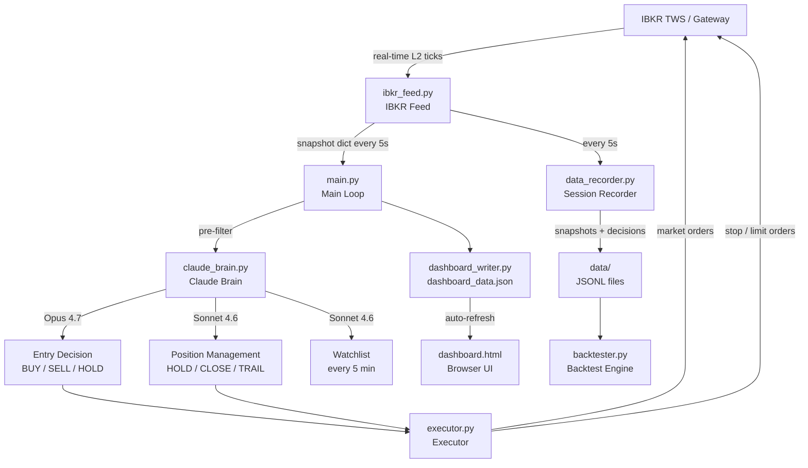
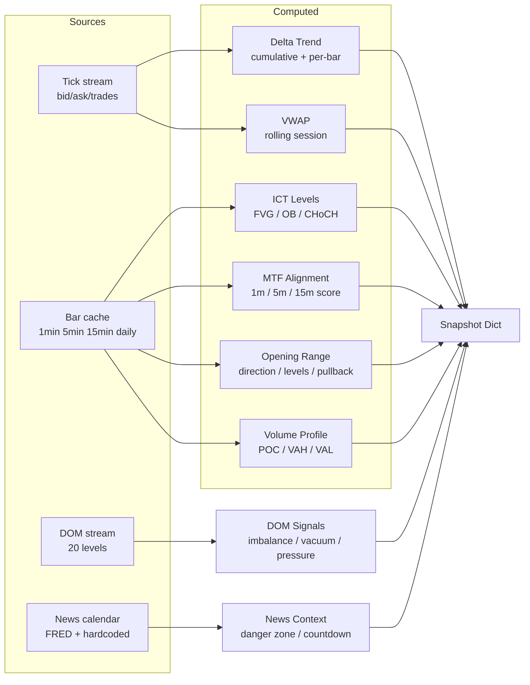
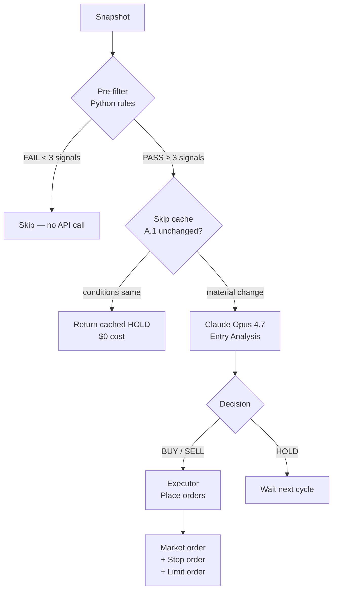
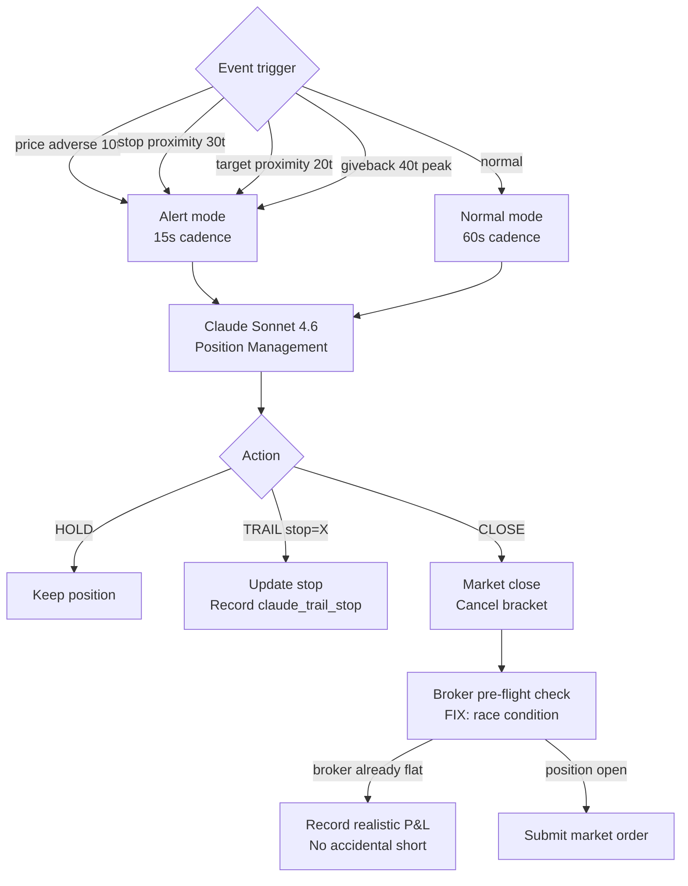
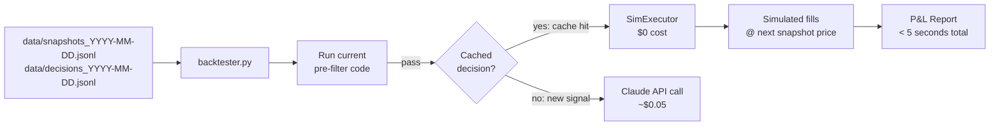
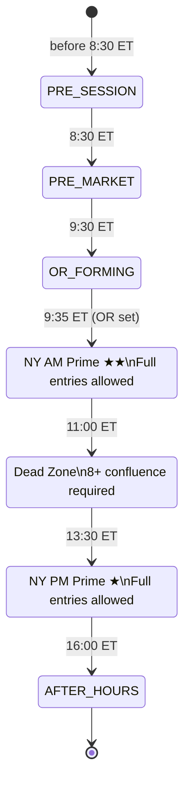
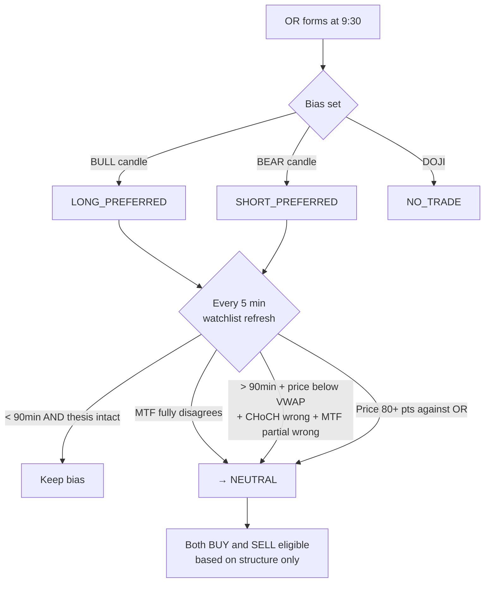

# MNQ AI Trader

An institutional-grade AI-driven futures trading bot for **MNQ (Micro E-Mini Nasdaq-100)** using **ICT (Inner Circle Trader) methodology**, **Opening Range Breakout (ORB)** strategy, and **Claude AI** for entry decisions and position management.

> **Status:** Paper trading — production-ready architecture, not yet live money.  
> **Account:** $50,000 simulated | **Max risk:** $500/day | **Max size:** 1 contract

---

## Table of Contents

1. [Architecture Overview](#architecture-overview)
2. [Data Flow](#data-flow)
3. [Strategy](#strategy)
4. [AI Decision Making](#ai-decision-making)
5. [File Reference](#file-reference)
6. [Configuration](#configuration)
7. [Setup & Running](#setup--running)
8. [Dashboard](#dashboard)
9. [Backtesting](#backtesting)
10. [Risk Management](#risk-management)
11. [Session Lifecycle](#session-lifecycle)
12. [Known Limitations](#known-limitations)

---

## Architecture Overview

The bot runs three concurrent loops:



### Three Loops Running Simultaneously

| Loop | Cadence | Thread | Purpose |
|---|---|---|---|
| Protection loop | 5 seconds | Background | Stop/target checks, broker reconciliation |
| Entry scan | 5 seconds | Main | Pre-filter → Claude Opus entry decisions |
| Position management | 15–60 seconds | Main (event-driven) | Claude Sonnet manages open trades |

---

## Data Flow

### Snapshot Assembly (every 5 seconds)

`ibkr_feed.py` assembles a ~40-field snapshot dict from multiple live sources:



### Entry Decision Flow



### Position Management Flow



---

## Strategy

### Opening Range Breakout (ORB) — V3.0 Bidirectional

Based on Zarattini, Barbon & Aziz (2024) — documented 1,637% return over 7 years on SPY/QQQ ORB.

**The OR is a starting bias, not a law (V3.0 change):**

| Time | Bias behaviour |
|---|---|
| 0–90 min after OR | OR direction = LONG_PREFERRED or SHORT_PREFERRED |
| After 90 min, structure disagrees | Bias decays to NEUTRAL automatically |
| MTF fully aligned against OR | Bias overridden to NEUTRAL immediately |
| Price 80+ pts against OR | Bias invalidated |
| NEUTRAL | Both BUY and SELL eligible based on structure |

**Three-stage ORB entry:**
1. Confirmed CLOSE outside OR range (not just a wick)
2. Price pulls back toward OR level (pullback in progress)
3. 1-min CHoCH confirms pullback complete → enter with tight stop

### ICT Methodology

Inner Circle Trader concepts used for setup identification:

| Concept | What it is | How bot uses it |
|---|---|---|
| **FVG** (Fair Value Gap) | 3-candle imbalance zone | Entry zone for pullbacks |
| **OB** (Order Block) | Last candle before impulsive move | Support/resistance anchor |
| **CHoCH** (Change of Character) | HH/HL or LH/LL break | Entry confirmation signal |
| **Liquidity pools** | Old highs/lows, equal highs | Target levels |
| **Inducement** | Retail stop-hunt before real move | Wait signal — don't enter yet |
| **BPR** (Balanced Price Range) | Overlapping bull/bear FVGs | Chop zone — stay flat |

### Watchlist — Dual-sided Game Plan (V3.0)

Every 5 minutes, Sonnet 4.6 generates a watchlist with:
- `bias` (LONG_PREFERRED / SHORT_PREFERRED / NEUTRAL / NO_TRADE)
- `bias_strength` (0–100)
- `bias_invalidated` (true/false) + reason
- **Bull setup**: trigger, entry zone, stop, target
- **Bear setup**: trigger, entry zone, stop, target (always present in V3.0)
- Key levels above and below

### Pre-filter Signal Scoring

Pure Python — no AI. Scores bull and bear signals independently:

**Bull signals (scored 1–2 each):**
- Above OR high (+2)
- CHoCH bullish (+2)
- Entry zone active (+2)
- Above VWAP (+1)
- Delta positive (+1)
- MTF aligned / partial bull (+1)
- DOM bid heavy / vacuum above / buy pressure > 65% (+1 each)
- Above VAH / above POC in VA (+1 each)

**Bear signals (symmetric)** — below OR low, CHoCH bearish, etc.

**Pass threshold:** 3+ signals on bias-preferred side, 5+ signals to go counter to bias preference.

### Strategy Performance Weighting

`strategy_stats.py` tracks per-strategy win rate and expectancy using Wilson 95% confidence interval (minimum 20 trades for instruction weighting). Claude's system prompt shows performance rankings so it can prioritize high-expectancy setups.

---

## AI Decision Making

### Model Allocation

| Decision | Model | Avg tokens | Est. cost | When |
|---|---|---|---|---|
| Watchlist | Sonnet 4.6 | ~1,700 | $0.015 | Every 5 min |
| Entry analysis | Opus 4.7 | ~5,500 | $0.05 | Pre-filter pass + not skip-cached |
| Position management | Sonnet 4.6 | ~1,200 | $0.006 | Every 15–60s in trade |
| Pre-market brief | Opus 4.7 | ~3,000 | $0.015 | Once at 8:30 ET |

### Cost Optimizations

**A.1 — Skip-when-unchanged:** If Opus returned HOLD and price moved <5pts, no new bar closed, watchlist not refreshed, and <3 min elapsed → return cached decision. Saves ~60–70% of Opus calls during repetitive HOLD windows.

**A.2 — Cache hygiene:** Static prompt block (watchlist + stable session context) carries Anthropic cache_control marker. Dynamic block (snapshot + volatile state + perf context) is never cached. Target: 70%+ cache hit rate on second call within 5-min window.

**A.3 — Per-call cost tracking:** Every API call logs `cost=$X.XXXX session_total=$X.XX`. `get_cost_summary()` returns breakdown by model and purpose.

### What Claude Actually Sees (Entry Prompt)

```
SYSTEM: ICT methodology, bidirectional framework, OR as starting bias,
        MTF rules, CHoCH requirements, stop/target structure

CACHED USER BLOCK:
  ═══ ACTIVE WATCHLIST ═══
  Bias: SHORT_PREFERRED (strength: 72/100)
  ── BULL SETUP ──  trigger / zone / stop / target / invalidation
  ── BEAR SETUP ──  trigger / zone / stop / target
  Key levels above: [29750, 29780, 29800]
  Key levels below: [29640, 29600, 29550]

  ═══ SESSION CONTEXT (stable) ═══
  OR Direction: BULL | OR High: 29658.25

DYNAMIC (uncached):
  Performance stats (changes on trade events)
  Last decision + consecutive holds
  MNQ MARKET SNAPSHOT — 14:07 ET
    Kill Zone / AMD Phase / Session
    HTF Bias (daily + 15min structure)
    MTF Alignment: PARTIAL_BEAR (2/3 TF bearish) | Score: 67/100 — 1 bull / 2 bear TFs
    ICT Levels (FVGs, OBs, liquidity)
    Economic Calendar Context (next event countdown, reactive window)
    Price / Bid / Ask / VWAP / Session H&L
    OR levels + pullback tracking
    Volume profile (POC/VAH/VAL)
    Delta Trend: NEGATIVE (recent 3 bars) (true bid/ask classification)
    DOM: imbalance / vacuum / buy pressure
    Recent 1-min candles (last 10)
    Risk state (position / daily P&L / loss remaining)
```

### Reasoning Quality

Claude's entries consistently reference:
- Specific price levels (not vague "support")
- Liquidity context ("all buy-side liquidity to 29706 already swept")
- R:R calculation before entering
- Structure invalidation condition
- Why NOT to enter is as important as why to enter

---

## File Reference

### Core Bot

| File | Size | Purpose |
|---|---|---|
| `main.py` | ~33KB | Entry point. Session state machine, run_cycle, pre-market, EOD. |
| `claude_brain.py` | ~66KB | All Claude API calls. Prompts, watchlist, entry analysis, position management, cost tracking, skip-cache logic. |
| `ibkr_feed.py` | ~71KB | IBKR connection. Live ticks, bar cache, DOM stream, snapshot assembly, ICT computation, OR tracking, tick state persistence. |
| `executor.py` | ~40KB | Order placement. Entry, stop, target, trail, close. Race condition fixes, R-budget, broker reconciliation. |
| `config.py` | ~7KB | All configuration. Reads `.env`, exposes typed constants. |

### Support Modules

| File | Size | Purpose |
|---|---|---|
| `dashboard_writer.py` | ~12KB | Writes `dashboard_data.json` with merge logic (preserves Claude reasoning across fast-ticker writes). |
| `memory_manager.py` | ~15KB | Session memory. Loads last 5 days of trade summaries into pre-market context. Saves EOD summary. |
| `news_calendar.py` | ~27KB | Economic calendar. FRED integration + hardcoded recurring events. Danger zone gating. Live countdown to next event. |
| `strategy_stats.py` | ~18KB | Per-strategy win rate / expectancy tracking. Wilson 95% CI. Feeds performance context to Claude. |
| `data_recorder.py` | ~10KB | **NEW** Records every snapshot and Claude decision to JSONL for backtest replay. |
| `backtester.py` | ~17KB | **NEW** Replay engine. Loads recorded sessions, runs current pre-filter, looks up cached decisions, simulates fills, outputs P&L. |

### Static Files

| File | Purpose |
|---|---|
| `dashboard.html` | Browser UI. Polls `dashboard_data.json` every 2s via JS fetch (no page reload, no flicker). |
| `.env` | API keys and configuration overrides. **Never commit this.** |

### Generated at Runtime (not committed)

| Path | What | Why not committed |
|---|---|---|
| `logs/` | Rotating log files | Too large, changes every run |
| `memory/` | Session JSONL summaries + tick state | Personal trading data |
| `data/` | Backtest recordings (snapshots + decisions) | Large, personal |
| `dashboard_data.json` | Live dashboard state | Ephemeral |
| `price_data.json` | Fast ticker price cache | Ephemeral |

---

## Configuration

All settings live in `.env`. Config is documented in `config.py` with defaults.

### Required (no defaults)

```env
ANTHROPIC_API_KEY=sk-ant-...          # Get from console.anthropic.com
```

### Common Overrides

```env
# IBKR
IBKR_HOST=127.0.0.1
IBKR_PORT=7497                        # 7497 = TWS paper, 4002 = Gateway paper
IBKR_CLIENT_ID=1

# Contract (update when MNQ rolls)
CONTRACT_EXPIRY=20260618              # Jun 2026 — update quarterly
CONTRACT_CONID=770561201              # IBKR contract ID for MNQM6

# Data
LIVE_DATA_ACTIVE=true                 # false = delayed data (no CME subscription)

# Risk
ACCOUNT_SIZE=50000
MAX_DAILY_LOSS_PCT=0.01               # 1% = $500 max daily loss
MAX_SESSION_R_LOSS=3.0                # Stop after 3R lost in session
MAX_CONTRACTS=1

# AI Models
CLAUDE_ENTRY_MODEL=claude-opus-4-7
CLAUDE_POSITION_MODEL=claude-sonnet-4-6
CLAUDE_STRUCTURE_MODEL=claude-sonnet-4-6
CLAUDE_USE_CACHING=true

# Recording
RECORDING_ENABLED=true                # false to disable backtest recording
```

---

## Setup & Running

### Prerequisites

```
Python 3.11
TWS (Trader Workstation) or IB Gateway running
Paper trading account enabled in TWS
CME real-time data subscription (or LIVE_DATA_ACTIVE=false for delayed)
Anthropic API key with Opus access
```

### Install Dependencies

```bash
pip install ib_insync anthropic pandas pytz python-dotenv schedule
```

### First Run

```bash
# 1. Clone repo
git clone https://github.com/YOUR_USERNAME/mnq-ai-trader.git
cd mnq-ai-trader

# 2. Create .env from template
cp .env.example .env
# Edit .env — add ANTHROPIC_API_KEY at minimum

# 3. Start TWS / IB Gateway
# Enable API connections: File → Global Config → API → Settings
# Check "Enable ActiveX and Socket Clients"
# Port: 7497 (TWS paper)

# 4. Start bot
py -3.11 main.py

# 5. Open dashboard
# Double-click dashboard.html in file explorer
# Or: open http://localhost in browser after running a simple HTTP server
```

### Recommended Start Time

**Boot at 8:20 ET** — gives 10 minutes for:
- IBKR connection
- Bar cache initialization (historical data fetch)
- Pre-market analysis at 8:30 ET
- Watchlist ready before OR forms at 9:30 ET

### Daily Workflow

```
8:20 ET  → py -3.11 main.py
8:30 ET  → Pre-market analysis (Opus) — game plan for the day
9:30 ET  → OR forms — bias set (LONG_PREFERRED / SHORT_PREFERRED / NEUTRAL)
9:35 ET  → Active scanning begins
11:00 ET → Dead zone (entries need 8+ confluence score)
13:30 ET → NY PM prime window opens
15:30 ET → EOD — positions closed, memory saved, Ctrl+C
```

---

## Dashboard

`dashboard.html` — open in any browser, no server needed (reads local JSON file).

### Layout

```
┌─────────────────────────────────────────────────────────────────┐
│ MNQ/AI │ 29680.75  │ [SCANNING] [FLAT] [NY PM KZ] [AMD] [NEWS] │ 14:07:22 │
│        │ B:29680.5 A:29681 │                                    │ LIVE L2  │
├────────┼─────────────────────────────────────┬──────────────────┤
│POSITION│ CLAUDE ANALYSIS                     │ MARKET CONTEXT   │
│        │                                     │                  │
│FLAT    │ [HOLD] CONF:MED SCORE:5/10         │ ▲ BULLISH FIRST  │
│+$0.00  │                                     │ H:29658 L:29531  │
│        │ Reasoning text (greyed if >5min)... │ ✓ BROKEN UP      │
│STOP  — │                                     │                  │
│ENTRY — │ THESIS — BIAS: SHORT_PREFERRED      │ HTF BIAS         │
│TARGET— │                                     │ ...              │
│        │ ── RECENT CANDLES (1-min) ─────     │                  │
│VWAP  — │ 2026-05-22 14:05 O:29681 H:...     │ ICT LEVELS       │
│SESS H  │                                     │ FVGs / OBs / Liq │
│SESS L  │ ── TODAY'S TRADES ──────────────    │                  │
│OR HIGH │ TIME  DIR  ENTRY   EXIT    P&L      │ STRUCTURE        │
│OR LOW  │ 13:52 LONG 29680  29669  -$23.50   │ CHoCH / MTF      │
│CUM Δ   │                                     │                  │
│        │                                     │ SESSION STATS    │
│DAILY   │                                     │ 0T 0W 0L —%WR   │
│LOSS    │                                     │                  │
│TRADES  │                                     │ SESSION LEVELS   │
│NET LIQ │                                     │ ...              │
├────────┴─────────────────────────────────────┴──────────────────┤
│ 🟢 No major events in next hour — clean technical window        │
└─────────────────────────────────────────────────────────────────┘
```

### Key Indicators

- **Reasoning block greys out** after 5 minutes (stale data indicator)
- **BIAS** shows LONG_PREFERRED / SHORT_PREFERRED / NEUTRAL with color coding
- **CUM Δ** green = net buyers, red = net sellers
- **NEWS dot** green = clear, red = danger zone active
- **Data mode** top-right: LIVE L2 (real-time CME) or DELAYED

---

## Backtesting

### How It Works



### Usage

```bash
# See what sessions are recorded
py -3.11 backtester.py --list

# Replay a day (uses cached decisions, free)
py -3.11 backtester.py --date 2026-05-27

# Verbose — see every pre-filter pass
py -3.11 backtester.py --date 2026-05-27 --verbose

# Skip uncached decisions (fastest, free)
py -3.11 backtester.py --date 2026-05-27 --no-live-claude
```

### Version Comparison Workflow

```bash
# Day 1: live session recorded with V3.0
py -3.11 backtester.py --date 2026-05-27
# → Trades: 4, P&L: -$43, W: 1 L: 3

# Make code changes for V4.0, push files

# Same day, new code:
py -3.11 backtester.py --date 2026-05-27
# → Trades: 3, P&L: +$12, W: 2 L: 1
# → Improvement: +$55 on same market conditions
```

Full day backtest runs in **under 5 seconds**. No IBKR connection needed.

---

## Risk Management

### Layered Protection

```
Layer 1: Hard daily loss cap ($500 = 1% of $50K)
         → Python gate in executor._safety_checks()
         → Checked before every entry

Layer 2: R-budget (3R per session)
         → Each losing trade accumulates R (actual loss / stop distance)
         → Stops new entries once 3R spent regardless of dollar P&L

Layer 3: Hold-time gate
         → Scalp: min 3 minutes before Claude can CLOSE
         → Swing: min 5 minutes
         → Emergency override: only if within 15 ticks of stop

Layer 4: Protection loop (5-second cadence)
         → Checks stop_price and target_price on every tick
         → stop_price = 0 guard: never triggers on invalid state

Layer 5: Broker reconciliation (every 20 seconds)
         → Compares local position state to broker
         → Detects and flattens orphan positions

Layer 6: P&L sanity bound
         → Rejects single-trade P&L > $1,000 as impossible
         → Prevents corrupt daily_pnl from gating future trades
```

### Race Condition Fix (Critical)

**Problem discovered 2026-05-22:** When Claude calls CLOSE at the same moment a bracket stop fires at the broker, the bot was submitting a market SELL from flat, accidentally opening a short position.

**Fix (executor.py):**
1. Pre-flight broker position check before any close submission
2. Post-cancel recheck — if stop filled during cancel, don't submit again
3. `_infer_recent_exit_fill()` — captures realistic exit price from broker fills
4. Orphan check runs synchronously on main thread (not background thread) to avoid asyncio errors

---

## Session Lifecycle



**OR bias decay (V3.0):**



---

## Known Limitations

**No prediction — only reaction.** The bot responds to what has already happened in price structure. There is no time-series forecasting, regime detection, or cross-asset correlation.

**Strategy stats need real history.** The Wilson CI weighting requires 20+ trades per strategy. Until then, all strategies are weighted equally. Currently at 0 trades in production database.

**Cache hit rate.** Prompt caching requires identical static block across calls. Block changes when watchlist refreshes (5 min) or when OR levels update. Cache hit rate should be 60–70% within a 5-min window; confirmed 0% across windows (expected).

**Pre-filter is directionally naive before V3.0 bias resolution.** The Python pre-filter scores bull and bear signals independently. When bias is LONG_PREFERRED and the bot is within 90 minutes of OR, bear signals require 5+ to pass (vs 3+ for bull signals). This is intentional.

**Single contract, no scaling.** Max 1 MNQ contract hardcoded. No partial exits, no pyramiding, no position sizing based on conviction level.

**Paper trading only.** Order execution has been validated (race conditions fixed), but live money adds slippage, liquidity constraints, and margin requirements not present in paper.

---

## Versions

| Version | Key Changes |
|---|---|
| V1.0 | Initial architecture, IBKR connection, basic ORB |
| V2.0 | Prompt caching, session memory, ICT levels, dashboard |
| V2.5 | P0 race condition fix, hold-time gate, skip-when-unchanged |
| V3.0 | Bidirectional bias (LONG_PREFERRED not LONG_ONLY), dual-sided watchlist, bias decay rules, backtest recording system |

---

## Contributing

This is a personal trading research project. PRs welcome for:
- New ICT signal detection
- Improved backtest simulation accuracy
- Dashboard enhancements
- Additional broker integrations

**Never commit `.env`, `logs/`, `memory/`, or `data/` directories.**

---

## Disclaimer

This software is for **educational and research purposes only**. Trading futures involves substantial risk of loss. Past performance of any strategy does not guarantee future results. This bot does not constitute financial advice. Use at your own risk.
