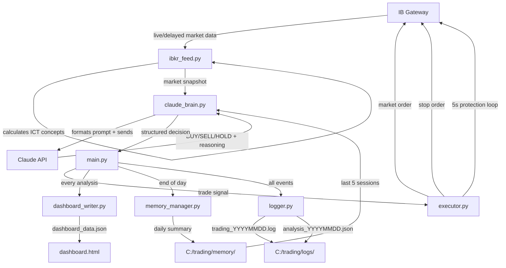
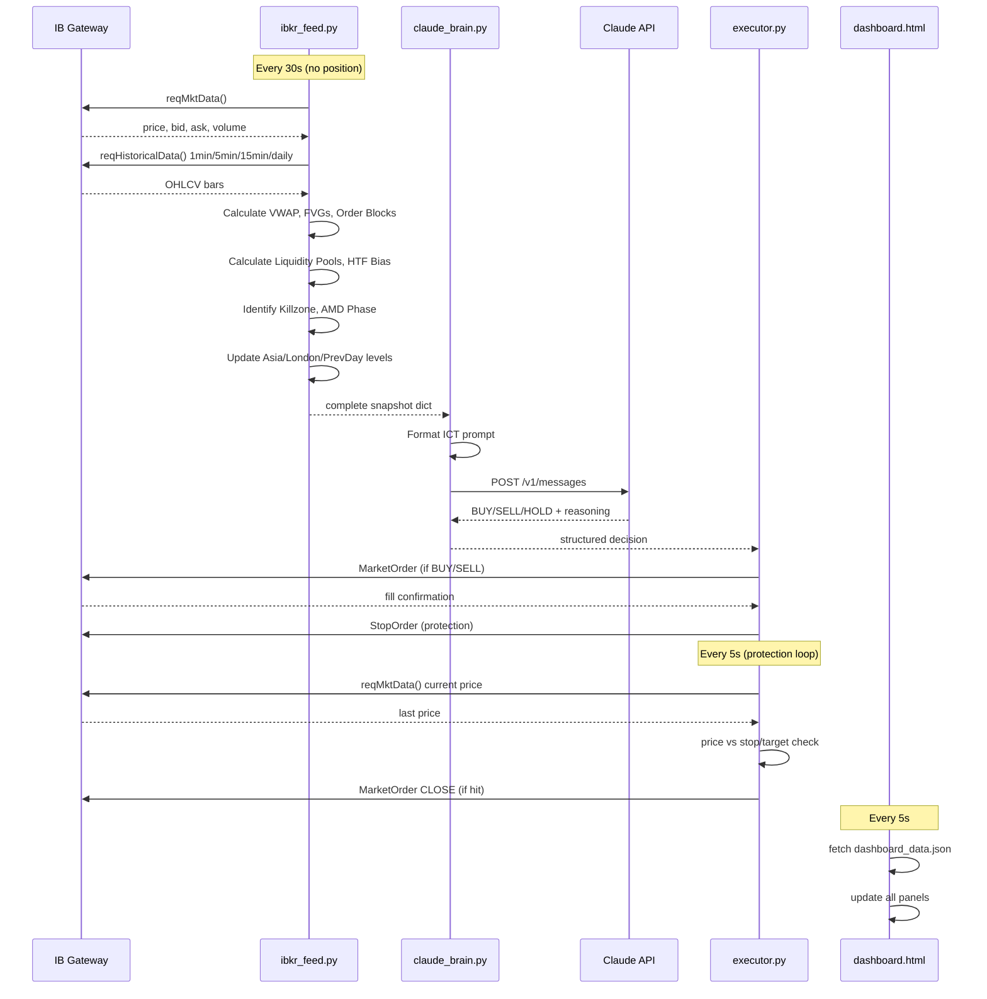

# MNQ AI Trader 🤖

An autonomous futures trading system for MNQ (Micro E-mini Nasdaq) using Claude AI as the decision-making brain. The system connects to Interactive Brokers, reads live market data, applies ICT (Inner Circle Trader) methodology, and executes trades autonomously with full risk management.

> **Status:** Paper Trading — Phase 1 (performance validation)

---

## How It Works

Claude AI acts as the trader. Every 30 seconds during RTH (Regular Trading Hours), the system feeds Claude a complete market snapshot — price, candles, order flow, ICT levels, session context — and Claude reasons through the setup using institutional trading concepts, then outputs a structured trade decision. A fast Python protection loop runs every 5 seconds independently to manage stops and targets without any AI latency.

### The Three Loops

```
Loop 1 — Protection (every 5s, pure Python, no API cost)
  Watches current price vs stop/target
  Fires market close order immediately if hit
  Trails stop on momentum trades
  No Claude API call — pure speed

Loop 2 — Position Management (every 10s, small Claude API call)
  Only runs when IN a trade
  Claude watches delta, DOM walls, momentum
  Decides: HOLD / CLOSE / TRAIL
  Tiny prompt — fast and cheap

Loop 3 — Entry Analysis (every 30s, full Claude API call)
  Only runs when FLAT (no position)
  Full market snapshot sent to Claude
  Claude applies 6-step ICT framework
  Outputs: BUY / SELL / HOLD with full reasoning
```

---

## System Architecture



---

## File Reference

| File | Role | Talks To |
|------|------|----------|
| `main.py` | Orchestrator — runs all loops, schedules pre/post market | All files |
| `config.py` | All settings — account size, risk, API keys, data mode | All files |
| `ibkr_feed.py` | IBKR connection + all market data + ICT calculations | IBKR Gateway |
| `claude_brain.py` | Builds prompts, calls Claude API, parses responses | Claude API |
| `executor.py` | Order execution + fast protection loop | IBKR Gateway |
| `logger.py` | Logs everything to files | Disk |
| `memory_manager.py` | Daily summaries + session memory | Disk |
| `dashboard_writer.py` | Writes live dashboard JSON after every cycle | Disk |
| `dashboard.html` | Live trading dashboard — open in browser | Reads dashboard_data.json |

---

## Data Flow Detail



---

## ICT Trading Framework

Claude applies a 6-step framework before every trade decision:

### Step 1 — Higher Timeframe Bias
- Daily chart trend (3 consecutive closes)
- 15min market structure (Higher Highs/Lows or Lower Highs/Lows)
- Sets directional bias: BULLISH / BEARISH / NEUTRAL

### Step 2 — AMD Cycle Phase
| Time (ET) | Phase | Meaning |
|-----------|-------|---------|
| 6pm–7am | Accumulation (Asia) | Institutions building positions. Note the range. |
| 7am–9:30am | Manipulation (London) | Fake move to hunt stops. If London sweeps Asia low → expect move UP |
| 9:30am–12pm | Distribution (NY AM) | Real institutional move. Trade WITH this direction |
| 12pm–1:30pm | Re-accumulation | Midday consolidation, reduced participation |
| 1:30pm–4pm | Late Distribution (NY PM) | Continuation or end-of-day reversal |

### Step 3 — Killzone Timing
Only trade during high-probability windows:
- **NY AM Killzone:** 9:30–11:00am ET ⭐ highest probability
- **NY PM Killzone:** 1:30–3:30pm ET ⭐ second best
- **London Killzone:** 3:00–5:00am ET (overnight monitoring)

### Step 4 — Key Levels (Priority Order)
```
Previous Week High/Low  ← most powerful
Previous Day High/Low
Asia Session High/Low   ← manipulation targets
London Session High/Low ← manipulation targets
Opening Range High/Low
VWAP                    ← institutional benchmark
```

### Step 5 — ICT Entry Concepts

**Fair Value Gaps (FVG)**
3-candle imbalance where the middle candle leaves a gap. Price is drawn back to fill these gaps. Bullish FVG = support. Bearish FVG = resistance.

**Order Blocks (OB)**
Last opposing candle before a strong impulse move. Institutions reload at these zones on pullbacks. Most powerful when combined with a nearby FVG.

**Liquidity Pools**
Equal highs = buy-side liquidity (stops sitting above). Equal lows = sell-side liquidity (stops sitting below). Price is engineered to sweep these before reversing — the manipulation phase.

**The High Probability Setup:**
```
London sweeps Asia low (manipulation — sell-side liquidity taken)
    ↓
Price returns to bullish FVG during NY AM killzone
    ↓
Bullish Order Block at same level
    ↓
VWAP below current price (support)
    ↓
Cumulative delta turning positive
    ↓
DOM showing bids stacking (when L2 active)
    ↓
ENTER LONG — stop below OB, target = London high (buy-side liquidity)
```

### Step 6 — Order Flow Confirmation
- Delta confirms direction (not diverging from price)
- Volume above average on entry candle
- DOM shows path of least resistance (when L2 subscription active)

---

## Risk Management

| Rule | Value |
|------|-------|
| Max daily loss | 1% of account |
| Max contracts | 1 MNQ |
| Per-trade stop | 4 ticks (scalp) / structure-based (swing) |
| Consecutive losses | Pause 30 min after 3 losses |
| Low confidence signals | Skipped automatically |
| End of day | All positions closed at 3:30pm ET |
| No-trade zones | 11:30am–1:30pm ET (midday) |
| News events | No trades 5 min before/after major releases |

---

## Session Memory System

Every day at 3:30pm the system automatically saves a summary to `C:\trading\memory\summary_YYYY-MM-DD.md` containing:
- P&L and trade statistics
- Every trade with entry reasoning and exit reason
- What setups worked and what failed
- Why Claude held (HOLD reasoning patterns)
- Self-assessment

Every morning at 9:30am the last 5 days of summaries are loaded into Claude's pre-market analysis context. This is how Claude builds pattern recognition and "screen time intuition" session over session.

---

## Live Dashboard

Open `dashboard.html` in any browser. It automatically polls `dashboard_data.json` every 5 seconds and shows:

- Claude status (ANALYZING / MANAGING POSITION / etc.)
- Current position (LONG / SHORT / FLAT)
- Market bias and AMD phase indicator
- Session levels (Asia, London, Previous Day)
- Claude reasoning feed — every decision with full explanation
- Trade log with confluence tags per trade
- Daily P&L with loss limit progress bar
- Professional metrics: Win Rate, Profit Factor, Expectancy, Avg Winner/Loser
- Equity curve
- Setup performance breakdown (SCALP vs SWING vs MOMENTUM)
- Left on table detection
- Active confluence indicators

---

## Setup Instructions

### Requirements
- Windows PC (runs during RTH)
- Python 3.11 (not 3.12+, ib_insync compatibility)
- Interactive Brokers account (Pro, futures enabled)
- IB Gateway installed and running
- CME Real-Time (NP, L2) data subscription (~$15/month)
- Anthropic API key

### Installation

```bash
# Install dependencies
py -3.11 -m pip install ib_insync anthropic pandas numpy python-dotenv pytz schedule

# Copy environment file
copy .env.example .env
# Edit .env with your actual keys
```

### Configuration (`.env`)
```
ANTHROPIC_API_KEY=your_claude_api_key
IBKR_HOST=127.0.0.1
IBKR_PORT=7497
IBKR_CLIENT_ID=1
ACCOUNT_SIZE=50000
MAX_DAILY_LOSS_PCT=0.01
```

### `config.py` Settings
```python
LIVE_DATA_ACTIVE = False  # Set True when CME L2 subscription active
```

### Running
```bash
# 1. Open IB Gateway and log in
# 2. Run the bot
py -3.11 main.py

# 3. Open dashboard in browser
# Open C:\trading\mnq-ai-trader\dashboard.html
```

---

## Live Data Upgrade

When `LIVE_DATA_ACTIVE = False` (current):
- Delayed price data (15 min delay)
- Approximated delta from bar closes
- No DOM / order book
- No volume profile

When `LIVE_DATA_ACTIVE = True` (after CME L2 subscription activates):
- Real-time tick-by-tick data
- True cumulative delta (every trade classified buyer/seller)
- Live 20-level DOM with large wall detection
- Volume Profile with Point of Control (POC) and Value Area High/Low
- One line change in config.py activates everything

---

## Branch Strategy

```
main        ← stable, tested, production
  └── develop     ← integration branch
        ├── feature/add-volume-profile
        ├── feature/news-calendar-api
        ├── fix/vwap-calculation
        └── backtest/swing-only-strategy
```

**Workflow:**
1. `Branch → New Branch` from develop in GitHub Desktop
2. Name: `feature/description` or `fix/description`
3. Make changes, commit with clear message
4. Push, open Pull Request to develop
5. GitHub Actions runs syntax check automatically
6. Merge to develop, test in paper trading
7. When stable, merge develop → main

---

## Roadmap

- [ ] News calendar API integration (ForexFactory)
- [ ] Breaker block detection
- [ ] Multi-timeframe FVG confluence scoring
- [ ] Automatic contract rollover (June → September expiry)
- [ ] Performance analytics export to CSV
- [ ] Telegram/SMS alerts for trade entries
- [ ] VPS deployment guide
- [ ] Live trading activation checklist

---

## Important Notes

- **Never commit `.env`** — API keys must stay local
- **Paper trading first** — minimum 2-3 weeks before going live
- **Review logs daily** — `C:\trading\logs\` and `C:\trading\memory\`
- **Monitor the dashboard** — especially during first live sessions
- Claude has no memory between API calls — the memory system compensates for this
- Past performance in paper trading does not guarantee live results

---

*Built with Claude Sonnet by Anthropic — ICT methodology by Michael J. Huddleston*
